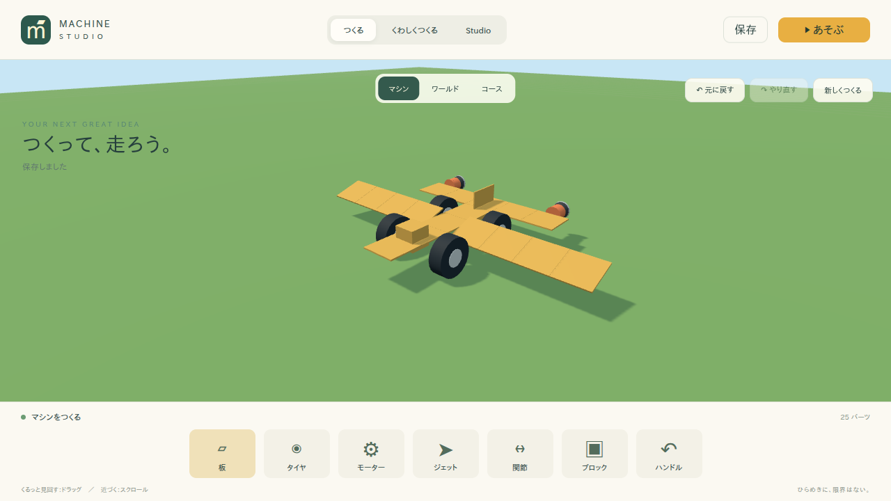
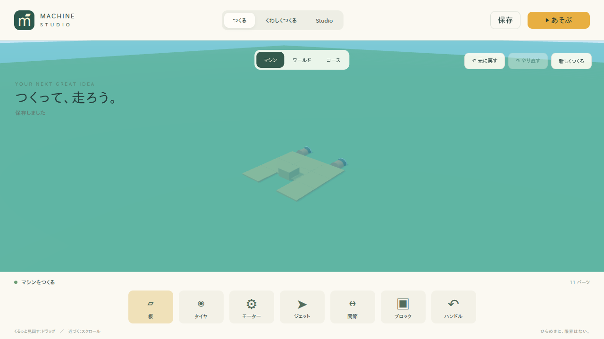

# Starter Template改善 実装報告

## 1. 現状調査

- 対象ブランチ`feat/panel-surface-aerodynamics`の最新HEADを起点に、`feat/starter-templates`を作成した。
- `packages/aerodynamics`には、PanelのWorld Normal、Panel位置の速度、面積、迎角からForce-at-pointで揚力と抗力を計算する既存Surface Aerodynamicsがある。
- `packages/physics-rapier`には、ThrusterのLOCAL +Z推力、Panel空力、metadata.buoyancyによる簡易浮力が既にある。
- 既存のPlane／Boat Templateは、少数のPanelとThrusterだけで、飛行機・船体としての構造が不足していた。

## 2. Plane Templateの旧構成

- Panel 5枚程度
- Thruster 1基
- 主翼、尾翼、Landing Gear、Cockpitの明示的な構造なし
- 決定論的な左右翼・尾翼配置なし

## 3. Plane Templateの新構成

新しい`planeTemplate()`は25 Partで構成した。

- 中央胴体：Panel 5枚
- 主翼：左右4枚ずつ
- 水平尾翼：左右2枚ずつ
- 垂直尾翼：Panel 1枚
- Cockpit：Block 1個
- Thruster：左右2基
- Landing Gear：Wheel 4輪

すべて通常のPartとConnectionで作成し、Plane専用metadataや専用Physicsは追加していない。

## 4. 主翼Panel数

合計8枚、左右4枚ずつ。Panelは既存仕様の正方形面を使用している。

## 5. 主翼取付角

主翼の取付角は左右とも`+18°`にした。PanelのLOCAL +Y Normalを前進時に正の迎角へ向け、`lift.y > 0`になることを空力Unit Testで確認した。

## 6. Tail構成

- 水平尾翼：後方左右2枚ずつ、合計4枚
- 垂直尾翼：後方中央1枚、Panel面をY-Z平面へ回転

専用Pitch／Yaw Stabilizer処理は追加していない。

## 7. Thruster構成

- 後方左右2基
- 各Thrusterの`actuator.motorTorque`は1600
- 既存のLOCAL +Z方向と`addForceAtPoint()`を使用
- 左右対称配置により、直進時の不要なYawを抑えた

## 8. Landing Gear構成

- Wheel 4輪
- 胴体下部の前後左右へ配置
- `metadata.drive = false`
- `actuator.motorTorque = 0`

したがって、飛行機の前進力はWheelではなくThrusterから発生する。

## 9. 機体総質量

- Plane Template全Partの合計：約201 kg
- Wheelsを除く主剛体：約189 kg
- Plane Panelは厚さ0.04 m、1枚10 kgとして重量配分を調整した

Panel全体の標準値や既存のPanel質量計算は変更していない。

## 10. 離陸時のおおよその速度

平坦な標準WorldでThrottle `+1`を与えた固定Step検証では、機体基準点が接地状態を離れて上昇へ移る時点の速度は約`27.1 m/s`だった。

## 11. 離陸までのおおよその時間

固定Step `1/60秒`で約126 Step、約`2.1秒`で機体基準点が`y > 0.5`へ上昇した。

## 12. AoA 0°との比較結果

同じ重量、同じThruster、同じ時間で主翼の取付角だけを0°へ変更した。

- 標準機の高さ変化：約1.62 m
- 0° Variantの高さ変化：約1.03 m
- 標準機は約2.1秒で接地高さを明確に超えた
- 0° Variantは同じ条件で、主翼による持続的な上昇を確認できなかった

標準機の上昇は、Plane識別子による補助Forceではなく、主翼Panelの正の迎角によるものになっている。

## 13. 翼面積減少Test結果

左右の外側主翼Panelを合計4枚取り除いたVariantでは、標準機より高さ変化が小さくなった。

- 標準機：約1.62 m
- 翼面積減少機：約1.00 m

翼面積を減らすと、同じ速度・迎角で得られるLiftが減少することを確認した。

## 14. Thruster低下Test結果

Thruster出力を各400へ下げたVariantでは、約3秒の固定Step検証で最大前進速度が約`10.1 m/s`に留まり、標準機の約`31.3 m/s`より明確に低かった。標準機のような離陸上昇も確認できなかった。

## 15. Boat Templateの旧構成

- 浮力Panel 1枚
- Thruster 1基
- Deck、Ponton、Cabinの構造なし

## 16. Boat Templateの新構成

新しい`boatTemplate()`は11 Partで構成した。

- 左右Ponton：各3枚、合計6枚
- Deck：Panel 2枚
- Cabin：Block 1個
- 後部Thruster：左右2基

左右Pontonは前後方向へ長く、左右対称のCatamaran構造にした。

## 17. Buoyancy Panel数

Pontonの6枚だけに`metadata.buoyancy = 1`を設定した。DeckとCabinには浮力metadataを付けていない。

## 18. Boatの安定性確認

Water height `1`のWorldで120 Step静置した後、Throttle `+1`とSteering入力を与えた。

- 最小Body Y：約0.39
- Up方向成分の最小値：約1.00
- 約3秒の前進距離：約11.1 m

即時沈没や大きな横転は発生せず、Thrusterで+Z方向へ前進した。

## 19. Boat Steering倍率問題を修正したか

修正した。

浮力処理内で、同じRigidBodyへSteering Torqueを浮力Panelごとに加えていた処理を、RigidBodyごとに最大1回へ変更した。6枚の浮力Panelと1枚の浮力Panelを同じ条件で比較するIntegration Testを追加し、Yaw角速度がPanel数に比例して増えないことを確認した。

## 20. Test追加内容

- `tests/unit/model.test.ts`
  - Planeの翼、尾翼、Thruster、Landing Gear、左右対称性、Connection、parseProject
  - BoatのPonton、Deck、浮力Panel、Thruster、左右対称性、Connection、parseProject
  - Landing Gearが非駆動であること
- `tests/unit/aerodynamics.test.ts`
  - AoA 0°と正のAoAのLift方向
  - 速度上昇に伴うDynamic PressureとLiftの増加
- `tests/integration/physics.test.ts`
  - PlaneのThruster加速と離陸
  - AoA 0° Variant
  - 翼面積減少
  - Thruster低下
  - Boatの浮上安定性と前進
  - 浮力Panel数によるSteering Torque倍率の回帰
- `tests/e2e/panel-aerodynamics.spec.ts`
  - Starter Planeの表示・保存・スクリーンショット
  - Starter Boatの表示・保存・スクリーンショット

## 21. 品質ゲート結果

- `pnpm typecheck`: PASS
- `pnpm lint`: PASS
- `pnpm test`: PASS（12 files / 100 tests）
- `pnpm build`: PASS（Studio / Player / Server）
- `pnpm test:e2e`: PASS（Chromium 22 tests）
- `pnpm smoke`: PASS（14 tests）

補足：

- Madgeの既存warning 4件はあるが、循環依存は検出されなかった。
- `pnpm format:check`は、今回変更していない`2026_0909_1650_報告内容.md`、`指示4.md`、`指示5.md`、`指示6.md`の既存フォーマット差分でFAILした。
- Build時のZod annotationと大きなChunkのwarning、Rapier初期化のdeprecated warningは既存の依存・構成由来である。

## 22. 変更ファイル一覧

- `packages/machine-system/src/index.ts`
- `packages/physics-rapier/src/index.ts`
- `tests/unit/model.test.ts`
- `tests/unit/aerodynamics.test.ts`
- `tests/integration/physics.test.ts`
- `tests/e2e/panel-aerodynamics.spec.ts`
- `docs/screenshots/starter-plane.png`
- `docs/screenshots/starter-boat.png`
- `2026_0911_1104_報告内容.md`

## 23. Visual Evidence

### Starter Plane

### Starter Boat

## 24. 残っている物理上の制約

Planeが飛ぶ因果関係は次の通りである。

1. ThrusterがLOCAL +ZへForce-at-pointを加える。
2. 機体の前進速度が増える。
3. 主翼PanelのWorld Normalと相対風から正の迎角が計算される。
4. `dynamicPressure = 0.5 * airDensity * speed²`により速度の二乗で空気力が増える。
5. `CL = PANEL_CL_MAX * sin(2 * angleOfAttack)`により正の迎角で上向きLiftが発生する。
6. 主翼PanelのWorld PositionへForce-at-pointを加えるため、揚力と重心の前後関係から自然なTorqueも発生する。

今回の実装は既存の簡易Surface Aerodynamicsと簡易Buoyancyの範囲であり、以下は未実装・未精密化である。

- Stall、Flow Separation、Downwash、Wingtip Vortex
- Elevator、Aileron、Rudderによる本格的な操舵
- Hydrodynamic Hull、Planing、Propeller、Rudder、Wave
- Ground effectと詳細なWheel Suspension

Planeの取付角、Panel厚さ、翼面積、Thruster出力は、現在の簡易物理モデルでStarter Templateが実際に離陸できる範囲へ調整した。
