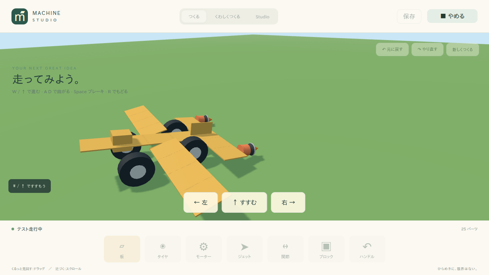
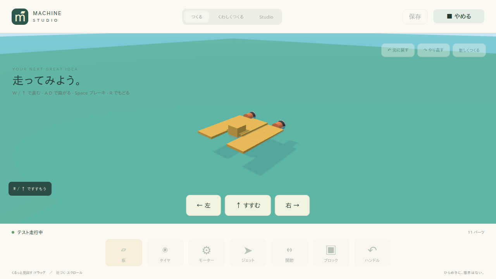
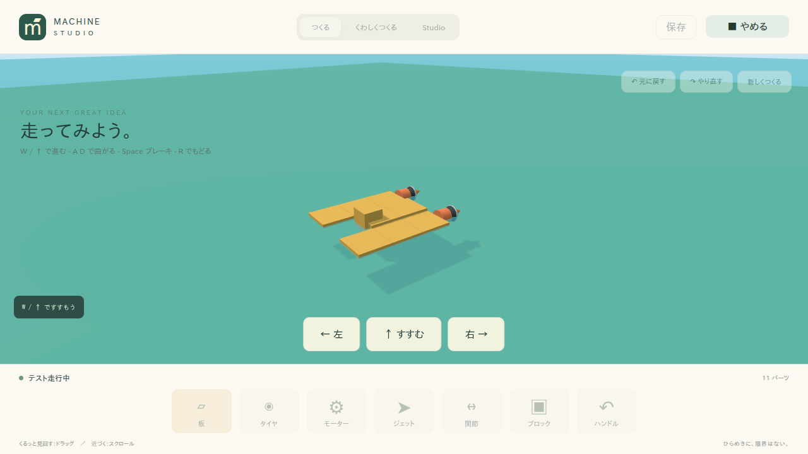

# Starter Plane / Boat 旋回・浮力物理 実装報告

## 1. 調査した現在実装

対象は現在のワークスペースです。`Engine`はW/S/A/Dを固定1/60秒で`RapierPhysics.step()`へ渡していました。`RapierPhysics`ではThrusterがすべて同じ`throttle * motorTorque`を出力し、Boatの浮力はPart質量と中心点の深さを基準にした`applyImpulse()`で実装されていました。

Planeは25 Part、Boatは11 Partです。Planeの主翼、尾翼、Cockpit、Landing Gear、Twin Thruster、およびBoatのTwin Ponton、Deck、Cabin、Twin Thrusterは既存構造を維持しました。

## 2. Planeが曲がらなかった原因

左右のThrusterが同一のThrottle値だけで駆動され、左右の作用点に推力差がありませんでした。そのため、推力の偏心によるYaw Momentが発生していませんでした。

## 3. Boatが曲がらなかった原因

BoatもPlaneと同じく、Thrusterへsteeringを渡していませんでした。さらに旧実装では浮力処理内に直接`applyTorqueImpulse()`を持っていましたが、これは差動推力による旋回ではありませんでした。

## 4. Boatが沈んでいた原因

旧浮力は`part.physics.mass`を基準にしており、Part自身の質量と中心点の深さだけで浮力を決めていました。排水体積、水密度、回転したBoxの水没率を使っていなかったため、船体全体の重量と水中体積の関係を表現できていませんでした。

## 5. Differential Thrustの設計

同じRigidBodyに固定されたThrusterをBody Local座標でまとめ、Local +Zへ十分向いているThrusterだけを前向きThrusterとしてMixer対象にしました。Local Xの左右位置から正規化した側方位置を求め、左右ThrusterのForce magnitudeを変えます。

各ThrusterのWorld DirectionとWorld Positionを求め、`command * actuator.motorTorque`をForceとして、そのThruster位置へ`addForceAtPoint()`しました。RigidBodyへ直接Yaw Torqueは加えていません。

## 6. Steering Mixerの式

実装式は次の通りです。

    base = clamp(throttle, -1, 1)
    steeringAmount = clamp(steering, -1, 1)
    normalizedSide = localX / max(abs(localX))
    command = clamp(
      base + steeringAmount * abs(base) * THRUSTER_STEERING_MIX * normalizedSide,
      -1,
      1,
    )

前向きThrusterが1基だけ、または中央にある場合はsteeringによる出力差を作りません。`throttle = 0`ではMixer出力も0です。

## 7. Steering Mix定数

`THRUSTER_STEERING_MIX = 0.65`です。前向き判定のDot Product閾値は`0.6`です。

## 8. 左右入力の検証結果

Engineの入力仕様どおり、Aは`steering = +1`、Dは`steering = -1`です。Integration Testでは`±0.7`を使用しました。

- Plane A：横方向移動`-18.33m`、Yaw変化`-0.624rad`
- Plane D：横方向移動`+18.51m`、Yaw変化`+0.593rad`
- Boat A：横方向移動`-2.289m`、Yaw変化`-0.625rad`
- Boat D：横方向移動`+2.289m`、Yaw変化`+0.625rad`

したがって、Aが左、Dが右となり、左右入力は概ね鏡像です。

## 9. Buoyancyの新しい式

浮力は次の式で計算します。

    buoyantForce = fluidDensity * abs(gravityY) * displacedVolume
    displacedVolume = partVolume * submergedFraction

`partVolume`は実寸サイズ3軸の積です。`transform.scale`も各軸へ反映しています。

## 10. WATER_DENSITY

`WATER_DENSITY = 1000 kg/m³`です。

## 11. 部分水没率の計算法

World回転後の3軸から、Boxの垂直Half Extentを次で近似します。

    verticalHalfExtent =
      0.5 * (
        abs(axisX.y) * sizeX +
        abs(axisY.y) * sizeY +
        abs(axisZ.y) * sizeZ
      )

その後、`bottomY`と`topY`を求め、次を0〜1へクランプします。

    submergedFraction =
      clamp((waterHeight - bottomY) / (topY - bottomY), 0, 1)

静止後の6枚のPonton水没率は、実測で次の範囲でした。

    0.307, 0.307, 0.370, 0.370, 0.432, 0.432

合計排水体積は約`0.266m³`です。

## 12. 浮力作用点

浮力とDragは各Buoyancy PartのWorld X/Z位置へ適用しました。Y位置は部分水没時の水中部分中央へ近似し、左右Pontonの水没差から復元Momentが発生するようにしています。

## 13. Water Dragの扱い

Water DragはImpulseではなくForceとして、作用点の速度に比例させて`addForceAtPoint()`しました。水没率ではなく排水体積でスケールしています。

- 水平Drag係数：`WATER_LINEAR_DRAG = 80`
- 垂直Drag係数：`WATER_VERTICAL_DRAG = 1500`

垂直方向は浮力の水面交差による振動を固定Stepで安定させるため、水平Dragと分けています。水上では排水体積が0なのでDragも0です。

## 14. Starter Boat総質量

Starter Boatの全Part質量は`249kg`です。Panelの質量を極端に下げたり、Block・Thrusterの質量を0にしたりする変更は行っていません。

## 15. 静止時の水没率

水面高さ`1`、Throttle 0で660 Step静置した実測値は、Pontonごとに約`0.307〜0.432`でした。Boatの基準位置Yは約`1.013m`でした。

## 16. Freeboard

代表Deck Panelの中心Yは約`1.097m`、上面Yは約`1.157m`でした。水面高さ`1`に対し、Deck中心で約`0.097m`、Deck上面で約`0.157m`のFreeboardを確保しています。

DeckとCabinはPontonの排水体積を増やす目的ではなく、Deckが水上へ出る形状調整として0.08m上げています。浮力metadataはPontonの6枚だけに残しています。

## 17. Plane直進Test

Throttle 1、Steering 0、180 Stepで次を測定しました。

- 前進距離：約`55.24m`
- 横方向移動：約`-0.70m`
- 最大前進速度：約`31.27m/s`
- 高さ変化：約`1.62m`
- Yaw変化：約`-0.087rad`

Steering 0では概ね直進し、従来の離陸性能を維持しています。

## 18. Plane左旋回Test

Throttle 1、Steering 0.7、180 Stepで横方向へ約`-18.33m`、Yaw変化約`-0.624rad`を測定しました。

## 19. Plane右旋回Test

Throttle 1、Steering -0.7、180 Stepで横方向へ約`+18.51m`、Yaw変化約`+0.593rad`を測定しました。

## 20. Plane離陸Regression

既存の離陸、迎角0度、翼面積減少、Thruster弱化のテストを残しました。標準Planeは高さ変化約`1.62m`、前進距離約`55.24m`、最大前進速度約`31.27m/s`で、ThrusterとPanel空力だけで離陸しました。

## 21. Boat静止浮上Test

水面高さ`1`で静置したBoatは、最小Up方向成分約`0.9997`でした。位置・回転は有限値で、Deck上面は水面上にあり、沈没や大横転は発生しませんでした。

## 22. Boat直進Test

Throttle 1、Steering 0、静置後180 Stepで、前進距離約`18.24m`、横方向移動はほぼ0、Yaw変化は約`0rad`でした。

## 23. Boat左旋回Test

Throttle 1、Steering 0.7、静置後180 Stepで、前進距離約`13.77m`、横方向移動約`-2.29m`、Yaw変化約`-0.625rad`でした。

## 24. Boat右旋回Test

Throttle 1、Steering -0.7、静置後180 Stepで、前進距離約`13.77m`、横方向移動約`+2.29m`、Yaw変化約`+0.625rad`でした。

## 25. Boat Roll復元Test

BoatをZ軸回りに8度傾け、Throttle 0で360 Step実行しました。Roll角は`0.1396rad`から約`0.000015rad`へ戻り、浮力の左右差による復元Momentで水平へ戻る傾向を確認しました。

## 26. 追加・変更したUnit Test

- `tests/unit/water-system.test.ts`
  - 水上、半分水没、完全水没
  - 体積、水密度、重力への比例
  - Tilt時の有限値と水没率範囲
- `tests/unit/thruster-steering.test.ts`
  - 左右同出力
  - 正負steeringによる差向き反転
  - throttle 0
  - 中央単一Thruster
  - 前向きThruster判定

## 27. 追加・変更したIntegration Test

`tests/integration/physics.test.ts`へ、Planeの直進・左右旋回、Boatの排水体積浮上、Freeboard、直進、左右旋回、Roll復元を追加しました。既存のStarter Plane離陸、AoA、翼面積、Thruster弱化、Starter Car、Motor、Hingeの回帰も維持しています。

## 28. 変更ファイル一覧

- `packages/water-system/src/index.ts`
- `packages/physics-rapier/src/index.ts`
- `packages/physics-rapier/src/thruster-steering.ts`
- `packages/machine-system/src/index.ts`
- `tests/unit/water-system.test.ts`
- `tests/unit/thruster-steering.test.ts`
- `tests/integration/physics.test.ts`
- `tests/e2e/panel-aerodynamics.spec.ts`
- `docs/screenshots/starter-plane-turn.png`
- `docs/screenshots/starter-boat-floating.png`
- `docs/screenshots/starter-boat-turn.png`
- `2026_0911_1214_報告内容.md`

Schema Version、Project Schema、Aerodynamicsの既存モデルは変更していません。

## 29. 品質ゲート結果

- `pnpm typecheck`: PASS
- `pnpm lint`: PASS
- `pnpm test`: PASS（14 files / 113 tests）
- `pnpm build`: PASS（Studio / Player / Server）
- `pnpm test:e2e`: PASS（Chromium 24 tests）
- `pnpm smoke`: PASS（Chromium 16 tests）
- 変更ファイルのPrettier check: PASS

既存依存由来のZod annotation warning、Rapier初期化のdeprecated warning、Rapier chunk size warningは出力されましたが、品質ゲートは成功しています。Madgeは循環依存なしでした。

## 30. Visual Evidence

### Starter Planeの旋回

### Starter Boatの浮上

### Starter Boatの旋回

E2EでW+A入力中のPlane、静止浮上中のBoat、W+A入力中のBoatを撮影しました。Studio手動確認でもPlaneのPlay/Stop復元とBoatの水面上のPlay状態を確認しました。

## 31. 残っている制約

今回の実装は指示7の範囲の簡易物理モデルです。厳密なHull clipping、Wave、Hydrodynamic Planing、Propeller、Rudder、Stall、Flow Separation、Downwash、Ground Effect、詳細なSuspensionは未実装です。

Boatの浮力は回転Boxの垂直投影による近似です。Planeの操舵もTwin ThrusterによるYaw Steeringまでで、Aileron、Rudder、Elevator、Bank Turnは今後の拡張範囲です。

それでも、Boatを軽くする固定値や専用Magic Forceではなく、`displacedVolume × waterDensity × gravity`を各Ponton位置へ連続Forceとして適用し、Plane/Boat共通の差動推力と作用点から旋回を成立させています。
