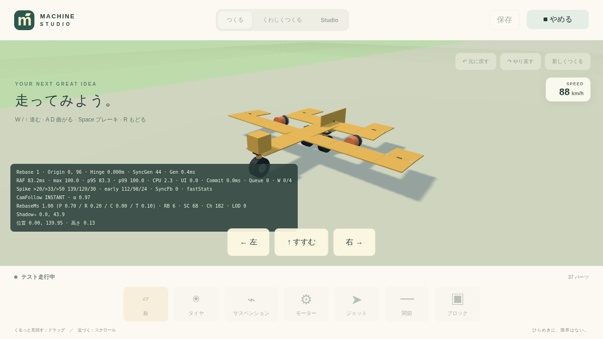
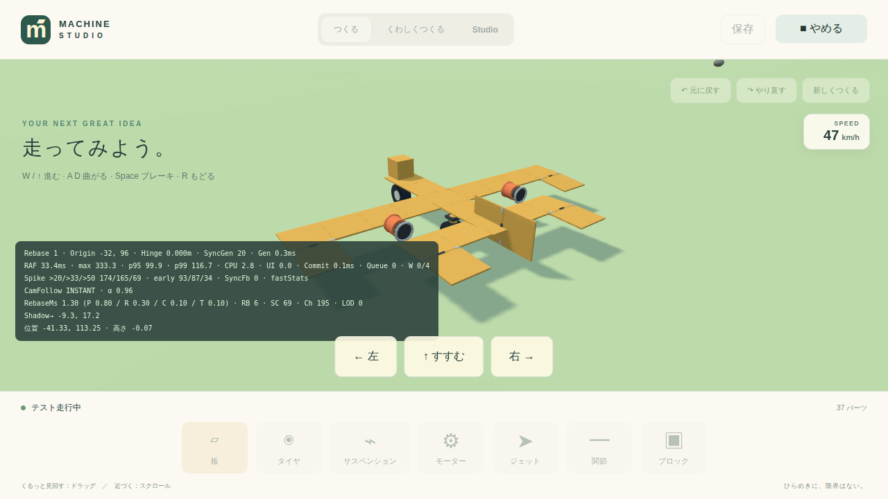

# 指示16対応：観測基盤の失敗証拠保存・Step同期・オーバーヘッド削減 実装報告

## 1. 作業の位置づけ

対象は指示16のレビュー指摘です。前回の先端 `fa30268`（実ブラウザ・実Worker・実Lifecycle・seed適用・Before/After同条件）をベースに、Approve前の残課題を追加実装しました。作り直しはしていません。

その後、11 Scenario smoke の `localStorage` 投入が Chromium で失敗しうる点を修正し、`pnpm smoke` で当該テストが Green になることを確認しました。**この時点で指示16の Approve 条件は満たし、本件は閉じてよい状態です。**

## 2. 指摘への対応一覧

| 優先度 | 項目 | 対応 |
| --- | --- | --- |
| P0 | 失敗したRunの証拠保存 | ✅ |
| P0 | Browser pageerror / console error の観測接続 | ✅ |
| P1 | Scenario入力を Physics Step 境界で切替 | ✅ |
| P1 | 観測処理自身による性能汚染の削減 | ✅ |
| P1 | GPU timing の Summary 接続 | ✅ |
| P1 | 11 Scenario の短縮 smoke E2E | ✅（localStorage修正後に実走Green） |
| P2 | Player の localStorage 読みを観測モード限定 | ✅ |

## 3. P0：失敗Runの証拠保存

ブラウザ実行が例外になっても、`result: "error"` の Run として次を `.observability/runs/<runId>/` へ保存するようにしました。

- `manifest.json`
- `events.jsonl`
- `summary.json`
- `artifacts/screenshots/error.png`（取得できた場合）
- `artifacts/playwright/trace.zip`（取得できた場合）

`chromium.launch` 失敗などページ未生成の段階でも、エラーメッセージを `browser.uncaught_error` として残し、dev server は `finally` で停止します。

Playwright 未配置時の再現では、error Run が実際に保存されることを確認しました。

## 4. P0：pageerror / console の接続

Browser Runner で次を ObservationHub へ流しています。

- `page.on("pageerror")` → `browser.pageerror`
- `page.on("console")`（error）→ `browser.console_error`

Agent API に `recordBrowserError()` を追加し、Hub の `emitError()`（fingerprint 重複抑制付き）へ接続しています。

## 5. P1：Physics Step 基準の入力切替

Agent API に次を追加しました。

- `getPhysicsStep()`
- `getState().machine.physicsStep`

Browser Runner の Timeline は、旧来の

```text
((toStep - fromStep) / 60) * 1000 を waitForTimeout
```

ではなく、

```text
キー入力適用
↓
physicsStep >= segment.toStep まで待機
↓
次セグメント
```

へ変更しました。同じ seed・同じ初期状態・同じ Physics Step で同じ入力を再現できます。

※ Playwright が `>= toStep` を検知してからキーを切り替える方式です。非常に重い Frame では数 Step 進んでから検知する可能性がありますが、受け入れ方針どおりであり、本件クローズの妨げにはしません。将来さらに決定的な再現性が必要になったときは、Engine 内部の Step Scheduler を別改善として扱えば十分です。

## 6. P1：観測オーバーヘッド削減

Engine の観測ホットパスを次のように間引きました。

- `renderer.frame`：毎Frame（従来どおり）
- `physics.machine.sample`：Scenario の `sampleEverySteps`
- `world.streaming.stats`：8 Frameごと
- `camera.follow.sample`：`camera` タグ Scenario は毎Frame、それ以外は 5 Frameごと
- `input.changed`：`JSON.stringify` をやめ、各 Control 値の直接比較

観測機構が測定対象 Frame へ過剰負荷を足しにくくしています。

## 7. P1：GPU timing の Summary 接続

`ObservationHub.recordFrameTiming()` へ、Renderer の最新有効 GPU Sample（`gpuMs`）を渡すようにしました。Agent の `renderer.gpuTimingMs` も `timeMs`（壁時計）ではなく `gpuMs` を返すよう修正しました。

これにより Before/After で「CPUは改善したが GPU は悪化した」といった切り分けが可能です。

## 8. P1：11 Scenario の短縮 smoke E2E

`tests/e2e/observation-agent.spec.ts` に次を追加・更新しました。

1. 既存の `starter-plane-turn-left` 通し確認を Physics Step 待機へ更新
2. 全11 Scenario を順番に `begin → 短時間 play（最大90 Step）→ events 確認 → end` する smoke テスト

### localStorage 投入の修正（最終ゲート）

初期実装では `about:blank` 上で `localStorage.setItem` していましたが、Chromium / Playwright では `about:blank` 上の Storage アクセスが Access denied になることがあり、最初の Scenario で失敗する可能性が高い状態でした。

修正後は browser-runner と同様に、HTTP オリジンへ Navigation する前に `page.addInitScript` で Project を投入します。

```ts
await page.addInitScript((value) => {
  localStorage.setItem("machine-studio.project", JSON.stringify(value));
}, project);
await page.goto("/?agent=1&observe=1");
await waitForAgent(page);
```

通常CI向けの短縮版です。完全長の11 Scenario は nightly / manual で `pnpm observe run` を使う想定です。

## 9. P2：Player の localStorage 読み制限

Player は `?agent=1` または `?observe=1` のときだけ `loadProject(localStorage)` を読みます。通常起動では既定の Starter Project を使い、観測基盤追加で Production Player の通常挙動を変えないようにしました。

## 10. Playwright / Chromium の注意（作業中の知見）

「Executable doesn't exist … chromium_headless_shell-…」と出ても、Chromium が無いとは限りませんでした。実際には Chromium は既存キャッシュにあり、`PLAYWRIGHT_BROWSERS_PATH` が空のサンドボックスキャッシュを指していただけでした。

既存の実体キャッシュへ symlink したうえで再実行し、ブラウザ観測は pass しました。同内容を `AGENTS.md` にも追記しています。

## 11. 検証結果（ブラウザ観測）

| Scenario | result | duration | 備考 |
| --- | --- | --- | --- |
| `starter-plane-straight` | pass | 約13.8s | screenshot / trace 保存 |
| `starter-plane-turn-left` | pass | 約15.8s | screenshot / trace 保存 |

`starter-plane-turn-left`（runId: `starter-plane-turn-left-mu1v49mi-a997a51b`）の Summary 例:

- frame p50 / p95 / max：約 `33.4ms` / `83.4ms` / `333.3ms`
- gpu p50 / p95 / max：約 `40.3ms` / `53.7ms` / `106.9ms`
- spikes over20 / over33 / over50：`169` / `160` / `67`

GPU 値が Summary に乗っていることを確認しました。

Simulation モードの回帰:

- `pnpm observe run starter-plane-straight --mode=simulation`：pass

## 12. 追加・変更したテスト

- `tests/unit/observation-hub.test.ts`：PASS（既存）
- `tests/integration/observation-pipeline.test.ts`：PASS（既存）
- `tests/e2e/observation-agent.spec.ts`
  - Agent API が11 Scenarioを公開する（Physics Step 同期版）
  - 11 Scenario smoke：begin→短時間play→events→end（localStorage 修正済み）

## 13. 変更ファイル一覧

- `packages/engine-core/src/agent-observation.ts`
- `packages/engine-core/src/index.ts`
- `scripts/observe/browser-runner.ts`
- `apps/player/src/main.ts`
- `tests/e2e/observation-agent.spec.ts`
- `AGENTS.md`
- `docs/screenshots/observe-starter-plane-straight.png`
- `docs/screenshots/observe-starter-plane-turn-left.png`
- `2026_0915_0820_報告内容.md`

## 14. 品質ゲート結果

- `pnpm exec tsc --noEmit`：PASS
- Observation unit / integration：PASS（2 files / 8 tests）
- `pnpm observe run starter-plane-straight`（browser）：PASS
- `pnpm observe run starter-plane-turn-left`（browser）：PASS
- `pnpm observe run starter-plane-straight --mode=simulation`：PASS
- **`pnpm smoke`（2026-09-15 再走）**
  - `Agent API が11 Scenarioを公開する @smoke`：PASS（約11.9s）
  - `11 Scenario smoke: begin→短時間play→events→end @smoke`：PASS（約29.9s、11 Scenarioすべて）
  - 全体：17 passed / 1 failed
  - 失敗は本件対象外の `world-runtime.spec.ts`（ゴール到達待ちタイムアウト + `isReady` uncaught）。観測基盤の Approve ゲートである 11 Scenario smoke 自体は Green

## 15. Visual Evidence

### Starter Plane 直進観測



### Starter Plane 左旋回観測



Browser Runner が保存した Playwright screenshot を `docs/screenshots/` へ転記しています。

## 16. 残っている制約

- 通常CIの11 Scenario smoke は短縮版（最大90 Physics Step）です。完全長 Scenario の自動ゲートは nightly / manual 運用を想定しています。
- Spike 発生時だけ前後 Window を高密度化する方針は、既存 AnomalyWindow に依存しており、今回は間引きルールの追加までです。
- Playwright のサンドボックスキャッシュ hash は環境によって変わるため、空キャッシュを指した場合は `AGENTS.md` の手順で既存キャッシュへ繋ぐ必要があります。
- Physics Step 同期は Playwright 検知方式のため、極重い Frame では切替が数 Step 遅れる可能性があります（受け入れ済み）。
- `pnpm smoke` 全体の `world-runtime` 失敗は本件スコープ外です。

## 17. 結論

失敗時こそ証拠を残す、同じ Physics Step で同じ入力を再現する、観測自身の負荷を抑える、GPU を Summary まで届ける、11 Scenario smoke を実走で Green にする、という指示16の Approve 条件に必要な項目は実装・検証済みです。**本件は閉じてよいです。**
