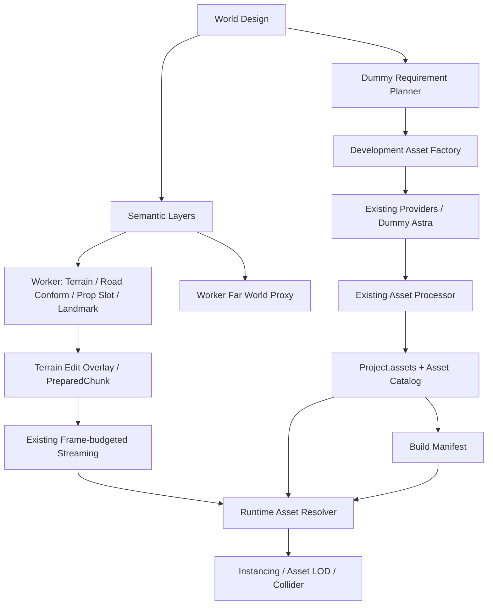

# 指示17対応：World生成基盤 / Asset Factory 実装報告

実施日：2026-09-16
対象ブランチ：`feat/world-generation-asset-factory`
基準ブランチ：`perf/async-world-streaming-frame-budget`
基準コミット：`006e006af6387f736ac134ac2a87604767599d75`

## 1. 実装概要

指示17の目的である、

```text
World Design
  ↓
Semantic Layers
  ↓
Terrain / Road / Biome / Prop / Landmark Generation
  ↓
Asset Slot
  ↓
Asset Resolver
  ↓
Asset Catalog
```

の経路を実装しました。

主な変更内容は以下です。

- World Designを正式なSchemaとして追加
- `toy-islands`の5島ワールドを追加
- World Designを共有するSemantic Layersを追加
- Design固定の地形・道路・山・集落・空港・Landmark生成を追加
- 道路のTerrain Conformを追加
- World座標ベースの決定的なProp配置とChunk境界のhalo判定を追加
- Propの主参照を固定`kind`から`assetSlot`へ拡張
- Asset Catalogと決定的Asset Resolverを追加
- Dummy Requirement Plannerと開発時Asset Factoryを追加
- Dummy Astra → Asset Processor → Asset Catalogの経路を追加
- ambientCG ZIPの安全な展開境界を追加
- Build Manifest / Bake / Catalog lockを追加
- Far World ProxyをWorker経由で追加
- World ValidatorとDevelopment Debug APIを追加
- 既存の32m Chunk Streaming、Worker Pool、Frame Budget、Floating Origin、Terrain Edit、Tombstoneを維持

RuntimeはAsset Factory、外部Provider、Astra、Blender、ネットワークに依存せず、保存済みのProject.assets、Catalog、Runtime Assetだけを使用します。

## 2. Architecture



依存方向は次のとおりです。

- `project-schema`：World Design、Project保存Schema
- `asset-core`：Asset共通型、Generator境界
- `asset-catalog`：Catalog index、query、resolver、fingerprint
- `asset-providers`：既存Provider
- `asset-pipeline`：既存Processor、安全なArchive処理
- `asset-factory`：Planner、Factory、Bake
- `world-generator`：Semantic Layers、地形、Prop、Validator、Proxy
- `world-system`：Worker、Streaming、Runtime連携

`world-generator`と`world-system`からAsset Factory / Provider / Processorへ依存する経路は追加していません。Package cycleも検出されていません。

## 3. 追加ファイル

- `docs/asset-factory.md`
- `docs/evidence/toy-islands-browser.json`
- `docs/evidence/world-generation-checks.json`
- `docs/evidence/world-generation-performance.json`
- `docs/screenshots/toy-islands-far.png`
- `docs/screenshots/toy-islands.png`
- `docs/world-generation-asset-factory-report.md`
- `docs/world-generation.md`
- `packages/ai-dummy/src/asset-generator.ts`
- `packages/asset-catalog/package.json`
- `packages/asset-catalog/src/index.ts`
- `packages/asset-factory/package.json`
- `packages/asset-factory/src/bake.ts`
- `packages/asset-factory/src/index.ts`
- `packages/asset-factory/src/planner.ts`
- `packages/asset-pipeline/src/archive.ts`
- `packages/project-schema/src/world-design.ts`
- `packages/renderer-three/src/far-proxy.ts`
- `packages/world-generator/src/design-generation.ts`
- `packages/world-generator/src/far-proxy.ts`
- `packages/world-generator/src/seed.ts`
- `packages/world-generator/src/semantic.ts`
- `packages/world-generator/src/toy-islands.ts`
- `packages/world-generator/src/types.ts`
- `packages/world-generator/src/validate.ts`
- `scripts/world-performance.ts`
- `scripts/world-tools.ts`
- `tests/e2e/toy-islands.spec.ts`
- `tests/fixtures/asset-factory.ts`
- `tests/integration/asset-factory.test.ts`
- `tests/integration/toy-islands-physics.test.ts`
- `tests/unit/asset-archive.test.ts`
- `tests/unit/world-design.test.ts`

## 4. 変更ファイル

- `KNOWN_ISSUES.md`
- `README.md`
- `apps/server/src/app.ts`
- `apps/studio/src/main.tsx`
- `package.json`
- `packages/ai-dummy/package.json`
- `packages/asset-core/src/index.ts`
- `packages/asset-pipeline/src/index.ts`
- `packages/asset-providers/src/index.ts`
- `packages/command-system/src/index.ts`
- `packages/engine-core/package.json`
- `packages/engine-core/src/agent-observation.ts`
- `packages/engine-core/src/index.ts`
- `packages/physics-rapier/src/index.ts`
- `packages/project-schema/src/index.ts`
- `packages/renderer-three/src/index.ts`
- `packages/ui-studio/src/index.tsx`
- `packages/world-generator/src/index.ts`
- `packages/world-generator/src/worker-entry.ts`
- `packages/world-system/package.json`
- `packages/world-system/src/chunk-worker-pool.ts`
- `packages/world-system/src/runtime.ts`
- `pnpm-lock.yaml`

既存の観測基盤ファイルは、World Runtimeの検証・Debug API・Worker接続に必要な範囲だけを変更しています。指示17と無関係な既存の物理・飛行・UI機能の作り直しは行っていません。

## 5. Schema変更

`CURRENT_SCHEMA_VERSION`は`6`のまま維持しました。

追加した任意フィールドは以下です。

- `project.world.source.design`
- `project.world.buildManifest`
- `project.assets[].catalog`
- `project.assets[].textureInfo`

World Designは`Record<string, unknown>`へ押し込まず、Zodで明示的に型付けしています。

主なSchemaは以下です。

- `WorldDesign`
- `IslandDefinition`
- `MountainDefinition`
- `RoadDefinition`
- `SettlementDefinition`
- `AirportDefinition`
- `LandmarkDefinition`
- `BiomeRegion`
- `NoSpawnRegion`
- `GameplayRegion`
- `PropRule`
- `WorldBuildManifest`

重複Design ID、不正なrange、危険なAsset配置参照、LandmarkやRegionの不正値を検証します。

## 6. Migration / 後方互換性

- 既存v6 Projectは追加フィールドなしで読み込めます。
- 既存v0〜v5のMigration経路は維持しています。
- 既存の`grassland`、`airfield`、`archipelago`はGenerator v1として従来の地形式、Seed派生、Entity IDを維持しています。
- 新しい`toy-islands`だけGenerator v2を使用します。
- 既存Terrain Editの`heightDeltas`、`colors`を保持します。
- `generatedEntityTombstones`と既存の削除済みEntity判定を保持します。
- 既存Worldの生成結果は100 Chunk比較で高さ、色、Entity、Hashが一致しました。

## 7. World Generation Pipeline

生成順序は以下です。

```text
World Design固定の島・山・Landmark
  ↓
Semantic Layer sampling
  ↓
Macro Terrain / Coast / weak seed detail
  ↓
Road / Settlement / Runway conform
  ↓
World-space Prop placement
  ↓
Fixed Landmark placement
  ↓
Terrain Edit Overlay
  ↓
Worker mesh / PreparedChunk
  ↓
Existing queue / frame-budgeted commit
  ↓
Catalog Asset Slot resolution
```

### Semantic Layers

World座標`(x, z)`から以下を共通Samplerで決定的に評価します。

- Island mask
- Height / Mountain mask
- Coast mask
- Biome
- Road influence
- Settlement mask
- Landmark mask
- No-Spawn mask
- Gameplay mask
- Runway mask

巨大なRasterは保存せず、Generator、Validator、Far Proxyが同じSampling経路を共有します。

### Terrain / Road

- 島の位置、大きさ、山の位置、道路はWorld Designで固定
- 海岸の細部と弱い地形ノイズだけをSeedで生成
- 道路はCatmull-RomのControl Point列で表現
- 道幅、路肩、Terrain Falloffを使い、地形を道路へ滑らかに寄せる
- `absolute` / `terrain`のElevation Modeに対応
- Chunkごとの独立計算ではなく座標サンプルで評価するため、Chunk境界で連続する
- Terrain Edit Overlayは最後に適用し、ユーザー編集を再生成で消さない

### Prop Placement

配置候補はIsland、Slot、Rule index、World cellをキーに生成します。

- Biome
- Altitude
- Slope
- Water distance
- Road distance
- Landmark distance
- No-Spawn
- Settlement / Runway
- Minimum spacing

を判定します。

最大Spacing幅のhaloを隣接Chunkへ広げ、Neighbour rejectionを行います。配置順やChunk読み込み順に依存せず、同一Seedでは同一配置になります。

生成Entity IDはSeed、Generator version、Semantic type、Stable cellから安定して生成し、Tombstoneを適用します。

## 8. Asset Factory Pipeline

開発時の処理順は以下です。

```text
World Design
  ↓
Asset Requirement Planner
  ↓
Catalog不足判定
  ↓
local
  ↓
kenney
  ↓
polyhaven
  ↓
ambientcg
  ↓
kaykit-local
  ↓
dummy-astra
  ↓
Existing Asset Processor
  ↓
Asset Catalog / Project.assets
  ↓
Build Manifest / Bake
```

Modeは次の3種類です。

- `dry-run`：不足Assetの表示だけを行い、取得・生成・保存をしない
- `offline`：Catalog、Local Library、Dummy Astraだけを使用
- `acquire`：Policyで許可されたProviderを利用し、不足時はDummy Astraへfallback可能

RuntimeからFactory、Provider、外部APIを呼び出す経路はありません。

## 9. Dummy Requirement Plannerの仕様

`AssetRequirementPlanner.plan(WorldDesign)`を将来のReal Plannerとの交換境界として追加しました。

Dummy実装はWorld Designの以下を走査します。

- IslandのPropRules
- Landmarks
- Settlements

Slotを重複排除して昇順に並べ、固定Policyで必要Variant数を決定します。

- Tree系：5
- Rock系：4
- Building系：3
- `course.jump_ramp`：3
- その他：1

`toy-islands`では10 Slot、合計28 VariantがRequirementになります。Biome集合と`stylized-low-poly`もRequirementへ付与します。

## 10. Dummy Astraの仕様

本物のAstra、OpenAI API、課金API、Blender自動操作は呼び出しません。

`DummyAstraAssetGenerator`は既存の`placeholderGlb()`を利用し、以下を記録します。

- `provider: "dummy-astra"`
- `model: "dummy"`
- `license: "project-owned"`
- 生成入力Hash
- Variant ID

Dummyでも、

```text
Asset Factory
  ↓
Dummy Astra
  ↓
placeholder GLB
  ↓
Asset Processor
  ↓
Asset Catalog
```

のEnd-to-End経路を実行します。各Variantは識別可能ですが、外観は共通Placeholderです。

## 11. Asset Catalog / Resolver

`Project.assets`を正本とし、Asset Catalogはその上のIndex / Query / Metadata / Fingerprint / Resolution層として実装しました。

Resolverは以下から決定的に候補を選びます。

- Asset Slot
- World Seed
- Stable placement ID
- Variant index
- Biome
- Style

候補が存在しない場合は`MissingAsset`として明示します。ResolverはFactory、Provider、Astraを呼びません。

Bakeでは以下を固定します。

- World / Design fingerprint
- Seed
- Generator version
- Asset Catalog fingerprint
- Required Assets
- Slotごとの候補Asset ID集合
- 解決Asset metadata hash
- Runtime fileのSHA-256
- Landmark / Course data

Bake後にCatalogへ新しいAssetが追加されても、完成済みWorldのSlot解決が変わらない構造にしています。

## 12. ZIP / Asset Processor安全境界

ambientCGなどが返すZIPをGLBとして直接解釈しないよう、Asset Processorに安全な展開境界を追加しました。

- Path traversal、絶対パス、Drive名、Backslash、NULを拒否
- Duplicate pathとSymlinkを拒否
- Source size、展開合計サイズ、Entry数を制限
- CRC、Compressed size、Expanded size、Header整合性を検証
- Nested archiveを拒否
- MIMEと拡張子を検証
- ZIP64、分割ZIP、暗号化ZIP、未対応圧縮方式を拒否
- GLB / glTFは通常Pipelineへ渡す
- glTFの外部ResourceはArchive内だけで解決
- PBR画像だけの場合はTexture Asset / unsupported stateとして保持
- 推測でMaterialを作らず、偽GLBへ変換しない

## 13. toy-islandsの仕様

World Designに以下の5島を固定しました。

- `central`：中心`(0, 0)`、半径190m、温帯草原、町、初期Spawn
- `tropical`：中心`(470, 220)`、半径165m、海岸、熱帯樹木、灯台
- `mountain`：中心`(-430, 310)`、半径200m、高さ85mの山、岩、観測所
- `airfield`：中心`(120, -470)`、半径220m、滑走路、管制塔
- `race`：中心`(-410, -340)`、半径175m、丘、道路、ジャンプ台、標識

島・山・Landmarkの位置はWorld Designで固定し、海岸の細部、地面の微細な起伏、Prop配置はSeedで生成します。

Studioから「おもちゃの群島」を選択して読み込めます。CLIでは道路に沿ったレースコースも生成します。

### Visual Evidence


## 14. Test / Build結果

### 品質ゲート

- `pnpm typecheck`：PASS
- `pnpm lint`：PASS
- `pnpm cycles`：PASS、循環依存なし
- `pnpm test`：37 files / 282 tests PASS
- `pnpm build`：Studio / Player / Server PASS
- `pnpm asset:plan`：10 Slot、28 Variant
- `pnpm asset:factory -- --mode=offline`：28 Asset登録、再実行時の追加登録0、不足0
- `pnpm world:validate`：1,183 Entity、error 0、warning 0
- `pnpm world:bake`：PASS
- `toy-islands` E2E：PASS

### 既存E2E / Smoke

- 全E2E：30 PASS / 4 FAIL
- `pnpm smoke`：18 PASS / 1 FAIL
- 既存テストの削除・Skipは行っていません。

失敗した既存テストのうち、以下3件は基準ブランチの隔離環境でも再現しました。

- `spike-flight-diagnostics`：Frame計測の浮動小数値を完全一致比較
- `spike-prewarm-diagnostics`：detach済みPage/Dialogに対する処理
- `world-runtime`：Goal到達待ちTimeoutと`undefined.isReady`

`runtime-stability`は初回カメラTarget差で一度失敗しましたが、基準比較と今回の単独再実行は成功しました。タイミング依存の結果として記録し、全E2E Greenとは報告しません。

## 15. Performance確認結果

Node同期計測のため、ブラウザのWebGL描画時間・GPU時間は含みません。

### 既存Presetの100 Chunk比較

- `grassland`：p50 約0.20ms、生成Prop 135、Baseline一致
- `airfield`：p50 約0.14ms、生成Prop 8、Baseline一致
- `archipelago`：p50 約0.17ms、生成Prop 33、Baseline一致

既存3 Presetは変更前後で高さ、色、Entity、Chunk hashが一致しました。

### toy-islands

- p50：約2.09ms
- p95：約2.98ms
- 最大：約3.39ms
- 100 Chunkの生成Prop：353

制約判定とProp数増加により、単純な旧Generatorより約10〜15倍のNode生成時間になっています。ただし生成はWorkerで実行し、Main Threadへ戻していません。

ブラウザ証跡では以下を確認しました。

- Far Proxy：5
- Render Chunk：169
- Physics Chunk：49
- 4輪の接地

実行環境はSoftware WebGLのため、これらの数値から60fps達成は証明していません。

## 16. 既知の制約

- Dummy Assetは共通Placeholderであり、木・灯台・管制塔などの完成モデルではありません。
- Real Requirement Planner、Real Astra、Real Blender computer-useは未実装です。
- PBR Texture Setは保存できますが、現在のRendererではunsupportedです。
- ZIP64、暗号化ZIP、分割ZIP、その他のArchive方式は未対応です。
- Mid専用Terrain LODは未追加です。
- Far ProxyにはPropとTerrain Editの細部を描画しません。
- 外部Providerの実際のAcquire通信はテストしていません。
- `style`はRequirement Tagであり、外観の自動画像判定は行いません。
- Bake時にAsset file hashを保存しますが、Runtime毎回の全ファイル再Hashは行いません。
- 既存E2Eに基準ブランチ由来の失敗が残っています。

## 17. 将来Real実装を接続する場所

### Real Requirement Planner

`packages/asset-factory/src/planner.ts`の`AssetRequirementPlanner`を実装し、Factoryへ注入します。RuntimeやWorld Generatorの変更は不要です。

### Real Astra

`packages/asset-core/src/index.ts`の`AssetGenerator`を実装し、Factory Constructorへ注入します。Dummy Astraと同じ`GeneratedAssetArtifact`境界を通して、既存ProcessorとCatalogへ接続できます。

今回のDummy経路を実際に検証しているため、Real実装を追加してもRuntimeへAI依存を持ち込む必要はありません。

## 18. 実行方法

```bash
pnpm asset:plan
pnpm asset:factory -- --mode=dry-run
pnpm asset:factory -- --mode=offline
pnpm world:validate
pnpm world:bake
pnpm dev
```

既定の保存先は以下です。

- Project：`.data/worlds/toy-islands.json`
- Asset：`.data/assets`

必要に応じて`--project=/path/project.json`、`--data-dir=/path/data`を指定できます。

Studio起動後、「おもちゃの群島」を選択してください。Runtimeは用意済みProjectとCatalogを読むだけで、Factoryや外部Providerを呼びません。

## 19. 最終レビュー

- 既存v1 Worldの生成結果を維持しました。
- `CURRENT_SCHEMA_VERSION=6`を維持しました。
- Project.assetsを二重管理する別Source of Truthは追加していません。
- RuntimeからFactory / Provider / Network / AIを呼ぶ依存は追加していません。
- DummyとRealの境界を別Interfaceとして定義しました。
- 外部素材のLicense Metadataを保持します。
- Source Assetの無断上書きを拒否します。
- 既存テストの削除・Skipは行っていません。
- 指示17の実装と検証に無関係な大規模な書き換えは行っていません。

以上により、World DesignからRuntime、Asset Requirement PlannerからCatalog、Dummy AstraからProcessorまでの指示17で要求された実装境界は完成しています。
