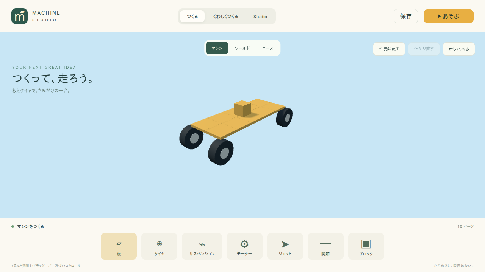
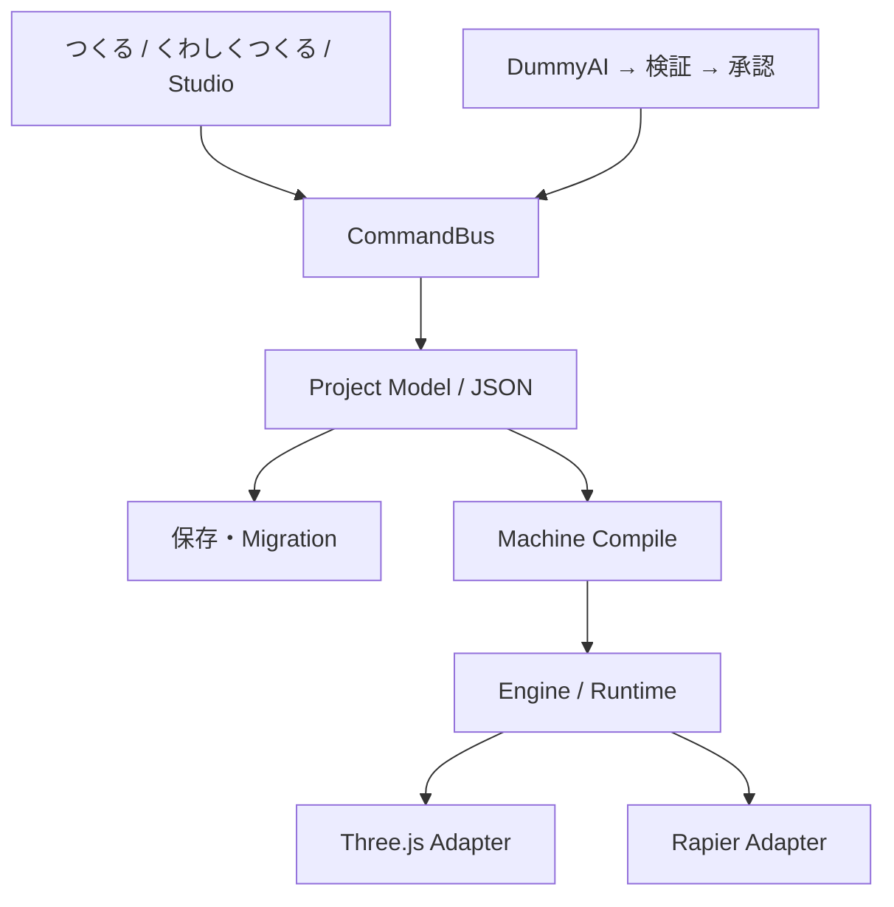

# Machine Studio

## Overview

板とタイヤを付けて、その場で走らせる。マシン・ワールド・コースを同じプロジェクトで制作する、3段階式ブラウザゲームスタジオです。



## Core Concept

「つくる」→「くわしくつくる」→「Studio」は、同じ保存モデルとCommand履歴を操作します。モードを切り替えても物理の詳細値は失われません。Playは編集モデルのコピーから実行世界を作り、Stopで編集状態へ戻ります。

## Main Features

- 板・ブロック・タイヤ・モーター・ハンドル・関節・ジェットを「選んで、光る場所を押す」だけで配置。Panelを辺で並べ、回転・Tilt・つけ直し・色・コピー・削除に対応。
- すべてのPanelを正方形の空力面として扱い、各Panelの位置速度とWorld Normalから力を計算。偏心したPanel／Thrusterの力は自然なTorqueを生みます。
- 接続候補の表示、4輪の駆動・操舵設定、複合剛体、可動関節、キーボード／ゲームパッド／画面ボタンでの試走。
- 6種類の地形ブラシ、水面、木・岩・建物、チャンク単位の描画・物理管理、同一素材のInstancing、距離LOD。
- 道、スタート、順序付きチェックポイント、ゴール、ジャンプ台、走行時間とリスポーン。複数コースから走行対象を選択・保存。
- Originalを保持したGLB取込、Runtime専用Meshopt／WebP最適化、LOD生成、Static AssetのHull／Trimesh Collider。
- 素材検索・プレビュー・GLB取込・ライブラリー保存・配置。Poly Haven、ambientCG、Local Library、Kenney Pack用の境界。
- ダミーAIの提案→プレビュー→承認→Command適用、Mock Blender Workerの生成Job。
- Undo / Redo、ブラウザー保存、JSON書き出し／読込、スキーマ検証と旧バージョン移行。

## Architecture



Project ModelはThree.js／Rapierを参照しません。EngineはReactに依存せず、独立Playerでも同じコードを実行します。

## Repository Structure

| ディレクトリ  | 内容                                                                 |
| ------------- | -------------------------------------------------------------------- |
| `apps/studio` | Reactによる3段階エディター                                           |
| `apps/player` | エディターを含まない実行画面                                         |
| `apps/server` | 素材取得・GLB処理・永続化・Job・本番配信                             |
| `packages`    | schema、Command、engine、描画、物理、各編集システム、AI、storage、UI |
| `tests`       | 単体、統合、Playwright E2E、固定fixture                              |
| `demos`       | 3つのプロジェクト、取得済み外部GLB、出典                             |
| `docs`        | 設計、判断記録、進捗、検証結果、スクリーンショット                   |

## Requirements

Node.js 22.12以降、pnpm 10.9、WebGL2対応のブラウザーが必要です。検証環境はNode.js 22.21.0／pnpm 10.9.0／Chromiumです。グローバルへの依存追加は行いません。PythonやBlender本体は初期実装には不要です。今後Python環境が必要になった場合はuvでプロジェクト内に作成します。

## Quick Start

最短手順は [QUICKSTART.md](QUICKSTART.md) にまとめています。このリポジトリのルートで:

```sh
pnpm install
pnpm dev
```

[Studioを開く](http://localhost:5183)。「くるま」を選び「▶ あそぶ」で試走できます。「じゆうにつくる」では、板を選んで中央の光る場所を押し、タイヤを選んで取り付け位置を押します。詳しくは[パーツ配置](docs/placement-system.md)を参照してください。

- W / ↑：前進、S / ↓：後退、A D / ← →：操舵。
- Space：ブレーキ、R：リスポーン。画面下の運転ボタンと標準ゲームパッドにも対応。
- ドラッグ：カメラ回転、右ドラッグ：カメラ移動、スクロール：ズーム。
- Ctrl / Cmd + Z：Undo、Shiftを加えるとRedo。
- 道具を選択して地面をクリックすると地形／コースを編集。道路はドラッグでも描けます。

## Development

```sh
pnpm dev:studio  # localhost:5183
pnpm dev:server  # localhost:8787
pnpm dev:player  # localhost:5184
```

素材機能にはServerも必要です。`pnpm dev`はStudioとServerを同時に起動します。ポート5183が使用中の場合は失敗して通知します。

## Environment Variables

[.env.example](.env.example)を参照してください。環境変数はシェルまたは実行環境から設定します。`.env`ファイルの自動読込は行いません。

| 変数             | 既定値  | 用途                   |
| ---------------- | ------- | ---------------------- |
| `PORT`           | `8787`  | Serverの待受ポート     |
| `ASSET_DATA_DIR` | `.data` | 素材とServer保存データ |

Importの安全上限は`ASSET_MAX_SOURCE_MB`、`ASSET_MAX_AGGREGATE_MB`、`ASSET_MAX_TEXTURE_DIMENSION`、`ASSET_MAX_TRIANGLES`、保存予算は`ASSET_STORAGE_BUDGET_MB`で設定します。既定値とBinary Upload APIは[Asset Pipeline](docs/asset-pipeline.md)を参照してください。Runtime Profileはquality／balanced／performance、既定値balancedです。

AIキーは不要です。実AIクライアントや有料APIのコードパスは含みません。

## Asset Providers

Poly Havenは公式APIでモデルを検索・取得し、1KのglTFと関連ファイルを原則として選び、GLBへ変換します。UIの出典表示、固有User-Agent、キャッシュを実装しています。[公式APIの利用条件](https://polyhaven.com/our-api)に基づき、素材のCC0ライセンスとAPIサービスの条件を区別しています。

ambientCGは公式APIの検索・メタデータ取得とダウンロード候補の取得に対応します。ZIP形式のマテリアルをGLBへ変換する処理は未実装です。Local Libraryは同梱素材と取得済み素材を扱います。Kenney Packはユーザーが公式Packを展開し、その中のGLBを読み込む方式です。Webスクレイピングは行いません。ユーザー提供のライセンスが未確認なら`unknown`として保持します。

## AI

`DummyAIProvider`が型付きPlanを返し、検証後にプレビューします。「承認して適用」で初めてCommandBusに渡します。任意コードは実行しません。`fail`を含む依頼では失敗状態を試せます。素材生成JobもMock Workerです。

将来の実Providerは`AIProvider`を実装して差し替えます。実API接続は別Phaseとし、キーはServerのみで扱う方針です。

## Testing

```sh
pnpm exec playwright install chromium --no-shell
pnpm typecheck
pnpm lint
pnpm format:check
pnpm test
pnpm test:unit
pnpm test:integration
pnpm test:e2e
pnpm smoke
```

E2EとSmokeは本番ビルドを作り、ポート8788の専用Serverを起動します。通常の開発データとは別に`.data/e2e`を使います。失敗時は`test-results`にスクリーンショットとTrace、Browser Consoleを保存します。CIは外部Provider障害をMockし、有料APIを使用しません。

`ALL_BROWSERS=1 pnpm test:e2e`でFirefox／WebKitも対象にできます。各ブラウザーのインストールは別途必要です。実通信の確認は`pnpm test:providers`、取得・変換までの確認は`IMPORT_ASSET=1 pnpm test:providers`です。

検証結果と具体的な対象は[testing.md](docs/testing.md)を参照してください。

## Build

```sh
pnpm build
pnpm start:server
```

本番Serverが[Studio](http://localhost:8787)と[Player](http://localhost:8787/player/)を配信します。既定ではローカル開発用途として127.0.0.1で待ち受けます。

## Project File Format

`schemaVersion: 4`を持つJSONです。Machine、World、Course、Assetの参照、Mission、settingsを保存します。大きなGLBはJSONに埋め込みません。バージョン0／1／2／3は読込時に移行し、v2のWingは正方形Panelへ、v3のMotorは速度設定を維持したままv4へ変換します。不正な参照・値・未知のバージョンは拒否します。[project-schema.md](docs/project-schema.md)と[aerodynamics.md](docs/aerodynamics.md)に詳細があります。

## Asset Licensing

取得元、作者、取得日時、ライセンス、原本と実行ファイルを保存します。アセットの出典不明をCC0と判断しません。同梱のRock 07はPoly Havenから取得したCC0素材です。[asset-licensing.md](docs/asset-licensing.md)を参照してください。

## Documentation

[設計](docs/architecture.md) / [Command](docs/command-system.md) / [Machine](docs/machine-system.md) / [Aerodynamics](docs/aerodynamics.md) / [World](docs/world-system.md) / [Course](docs/course-system.md) / [Asset Pipeline](docs/asset-pipeline.md) / [AI](docs/ai-integration.md) / [性能](docs/performance.md) / [セキュリティ](docs/security.md) / [進捗と完成条件](docs/progress.md) / [実行計画](docs/implementation-plan.md) / [判断記録](docs/decisions)

スクリーンショットは[docs/screenshots](docs/screenshots)に7種類あります。デモは[車](demos/demo-simple-car.json)、[島コース](demos/demo-island-course.json)、[外部素材ワールド](demos/demo-asset-world.json)。StudioのJSON読込で開けます。同梱素材はServer起動時にデータディレクトリへコピーします。

## Current Status

要件51の初期マイルストーンを維持し、指示2の6項目を実装しました。今回の最終結果は[実装報告](docs/world-runtime-report.md)と[品質ゲート](docs/evidence/world-runtime-quality-gates.json)を参照してください。[達成表と証拠](docs/progress.md)を参照してください。高度な拡張機能の未実装は[KNOWN_ISSUES.md](KNOWN_ISSUES.md)に明記しています。

## Roadmap

Phase 0–10でモデル・物理・3段階UI・ワールド・コース・素材・ダミーAIを実装。Phase 11で描画チャンクのロード／破棄と固定部品の複合化を追加しました。指示2では物理チャンク、Instancing、LOD、Static Asset Collider、非破壊Runtime最適化と容量設計、コース選択を追加しました。空力／浮力の精度、ZIP素材変換、センサー・ロジック等は今回の対象外です。

## License

新規実装コードは[MIT License](LICENSE)。同梱外部素材は各AssetRecordのライセンスに従います。ユーザー提供の仕様書・画面イメージの権利はこのコードライセンスの対象外です。
