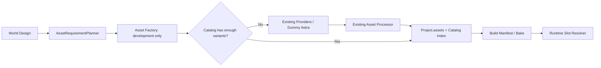

# Asset Factory / Catalog



## 責務と依存境界

`Project.assets`が正本です。`AssetCatalog`はSlot index、query、metadata、fingerprint、決定的resolution、登録のみを扱います。取得・加工はしません。Project.assetsを直接編集する場合はCatalogを再作成するか`reindex()`してください。

`asset-factory`はNodeの開発ツールです。既存`asset-providers`と`asset-pipeline`を利用します。`world-generator`はAsset Slotだけを出力し、`world-system`はブラウザで動く`asset-catalog`だけに依存します。RuntimeのGLB/Colliderファイル読込以外の外部Asset検索・生成・ダウンロードはありません。

## PlannerとDummy Astra

`AssetRequirementPlanner.plan(WorldDesign)`が交換用境界です。`DummyAssetRequirementPlanner`は島のPropRules、Landmarks、SettlementsからSlotを重複排除して昇順に並べ、木5、岩4、building3、jump_ramp3、それ以外1を要求します。Biome集合と`stylized-low-poly`を付けます。toy-islandsでは10 Slot、計28 variantです。

`asset-core`の`AssetGenerator.generate(AssetGenerationRequest)`が生成交換境界です。`ai-dummy/src/asset-generator.ts`の`DummyAstraAssetGenerator`は既存`placeholderGlb()`を使い、provider=`dummy-astra`、model=`dummy`、license=`project-owned`と生成入力hashを記録します。各variantは識別が異なる共通placeholder形状です。OpenAI API、Astra、Blender、課金APIは一切呼びません。

将来Real PlannerはPlanner interface、Real AstraはAssetGenerator interfaceを実装してFactoryへ注入します。Runtime側を変更する必要はありません。Real実装は今回含みません。

## FactoryとPolicy

処理順はRequirement→Catalog不足判定→Provider検索→許可候補取得→Processor→Catalog登録です。Catalog候補はSlot、style、必要Biome、model/ready、licenseで判定します。既存Providerを重複実装しません。

初期優先順位はlocal→kenney→polyhaven→ambientcg→kaykit-local→dummy-astraです。KenneyとKayKitは利用者が用意するローカルPack境界です。KayKit公式APIやHTML scrapingは仮定しません。CLIのLocal Libraryは既存の`data-dir/library.json`からmodelを検索し、必要になったruntime GLBだけを読み込みます。Kenney/KayKitの専用Pack Providerは空で、利用者のPackをプログラムから注入できます。

初期許可ライセンスはCC0/project-ownedのみです。unknownは採用しません。source、license、author、sourceUrl、retrievedAtを保持します。Factory結果は登録済み、不足、unsupported、取得失敗を分けます。styleはRequirementのタグとして付与し、外観がそのstyleに一致するかの自動画像判定はしません。外部取得素材を完成Worldへ採用する際は外観の確認が必要です。

| mode    | 動作                                                             |
| ------- | ---------------------------------------------------------------- |
| dry-run | Catalog不足を報告。Provider検索・取得・生成・保存をしない        |
| offline | Catalog、LocalLibrary、Dummy Astraのみ。glTFの外部resourceも禁止 |
| acquire | Policyで許可されたProviderを順に利用し、Dummyへfallback可能      |

CIと通常テストはofflineまたはmockを使います。acquireで実際の外部サービスを呼ぶテストは含みません。

## Processor / ZIP

既存ProcessorのGLB/glTF検証、原本、runtime GLB、利用可能なLOD、Collider、サムネイル、profile、安全上限、保存失敗のrollbackを維持します。元々小さいplaceholderは簡略化できずLOD0のみになる場合があります。

ZIPはGLBとして解釈せず、明示的な展開境界を通します。仕様参照は[PKWARE ZIP APPNOTE](https://pkware.cachefly.net/webdocs/casestudies/APPNOTE.TXT)です。

- path traversal、絶対パス、ドライブ名、backslash、NUL、重複パス、symlinkを拒否。
- source上限（既定128MiB）、展開合計上限（既定512MiB）、256 entry上限。
- CRC32、圧縮サイズ、実展開サイズ、Local/Central Headerの対応を検証。DEFLATEは宣言サイズで出力を制限。
- 拡張子・実データMIMEを検証。入れ子archiveを拒否。
- 対応は非暗号化ZIPのstore/deflate。ZIP64、分割ZIP、非対応圧縮方式は拒否。
- GLBまたはglTFが1個なら通常Processorへ渡し、glTF resourceはarchive内だけで解決。モデルが複数なら曖昧として拒否。
- PNG/JPEG/WebP画像だけの素材は`type=texture`として原ZIP・画像群を保存。roleを推測したMaterialや偽のGLBは作らない。
- 現RendererはPBR texture setを扱わないため`textureInfo.state=unsupported`、Catalog statusもunsupported。モデルResolverの候補や必要model variant数には数えない。Studioで未対応表示し配置を禁止。

画像は寸法上限も検証します。EXR、TIFF等は現段階では明示的な非対応です。source保存を優先し、Renderer対応ができるまで誤ってモデルとして消費しません。textureの`files.runtime`はSchema v6互換のため元ZIPを指し、利用側はtype/stateで除外します。

## Resolver / Bake

`resolveAssetSlot(slot, context)`は候補をIDで整列し、seed、slot、stable placement ID、variantIndexから決定的に選びます。Biome/style絞り込みに対応し、候補がない場合は明示的な`MissingAsset`です。

`bakeWorld(project)`はWorld/Design/seed/generatorVersion/landmark/courseのfingerprint、Catalog fingerprint、必要Assetとruntime SHA-256、解決に使うAsset metadataのhash、Slotごとの候補ID集合を保存します。配置IDからの選択規則と候補集合を固定するため、Catalog追加後も同じ配置は同じAssetを使います。毎配置の巨大JSONやTerrain meshは保存しません。

`validateBake()`およびEngine load時の`assertBakedProject()`で、World変更や固定Asset metadataの欠損・hash変更を検出します。Assetファイルのハッシュは加工時に算出します。Runtimeは毎回ファイル全体のSHA-256を検算しないため、配布時にはmanifestとファイルをまとめて不変成果物として管理してください。

## Commands

```bash
pnpm asset:plan
pnpm asset:factory -- --mode=dry-run
pnpm asset:factory -- --mode=offline
pnpm world:validate
pnpm world:bake
```

`--project=/path/project.json`、`--data-dir=/path/data`を指定できます。既定は`.data/worlds/toy-islands.json`と`.data/assets`。開発Serverも同じdata-dirを使用してください。`asset:plan`とdry-runはファイルを作りません。offline完了後の再実行は不足がなければ何も生成しません。
