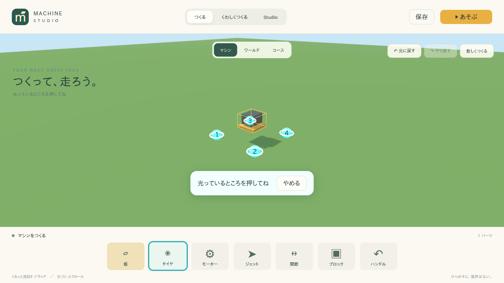
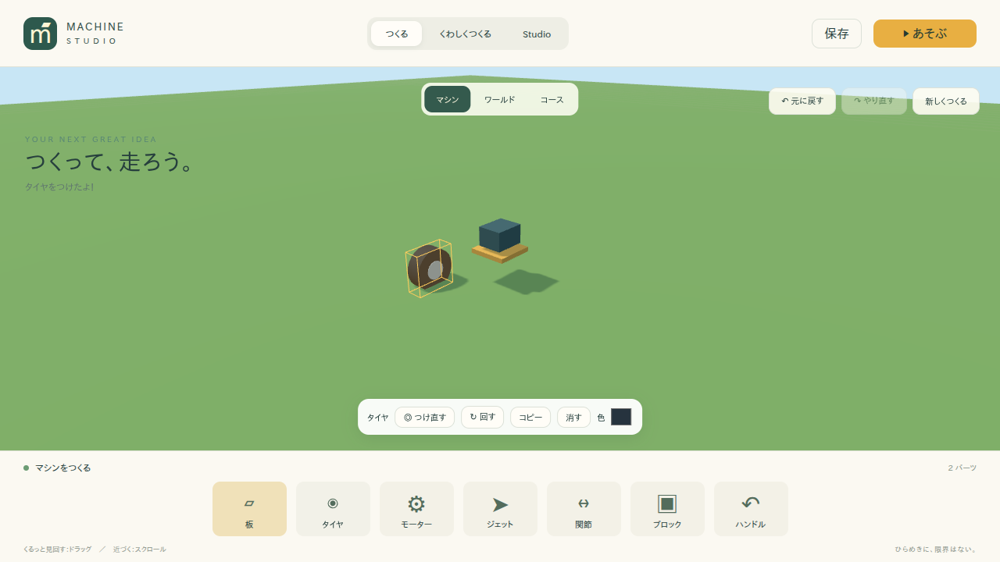
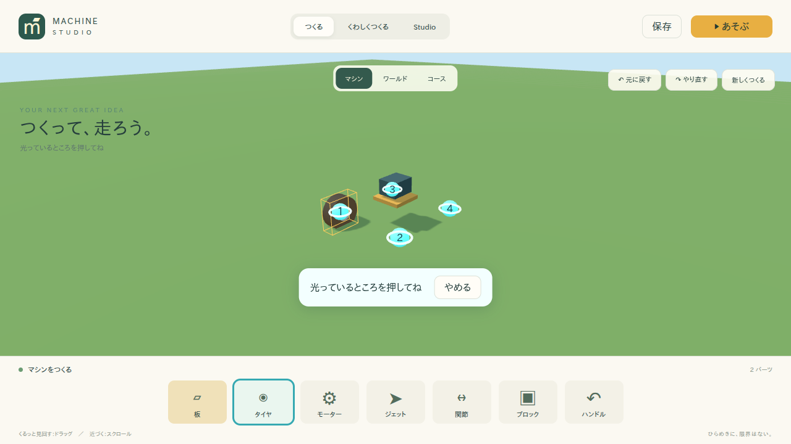

# 指示3の実装報告

LEVEL 1の8種類のパーツ配置を「パーツ選択 → 光る場所を押す → 自動取り付け」へ変更しました。タイヤの基本フローを先にE2Eで通し、その後に他パーツ、回転、つけ直し、コピー、Ghost、タッチへ拡張しました。

ベースは`git fetch origin feat/world-runtime-foundations`で取得した最新コミット`04d34f0`です。作業開始時の`feat/machine-placement-system`も同じコミットで、既存Unit 28件、Integration 19件、E2E 11件、型、Lintを確認しました。Python環境構築やグローバルインストールは行っていません。

## 変更ファイル

| ファイル                                                        | 変更内容                                                        |
| --------------------------------------------------------------- | --------------------------------------------------------------- |
| `packages/machine-system/src/index.ts`                          | 純粋な候補計算、互換性、旧接続情報補完、共有確定処理、Wheel設定 |
| `packages/machine-system/src/math.ts`                           | クォータニオンからEulerへの変換と特異姿勢への対応               |
| `packages/command-system/src/index.ts`                          | part.attach、part.reattach、part.turn、子孫と接続軸の変換       |
| `packages/project-schema/src/index.ts`                          | optionalなConnector互換性と面法線                               |
| `packages/renderer-three/src/index.ts`                          | 汎用候補、Ghost、選択枠、クリック・タッチ・ドラッグ判定         |
| `packages/ui-easy/src/index.tsx`                                | パレットの選択状態とaria-pressed                                |
| `apps/studio/src/main.tsx`                                      | Placement Session、確定／取消、簡単操作、LEVEL 1の専門値非表示  |
| `apps/studio/src/style.css`                                     | 候補ラベル、操作案内、選択色、狭い画面への対応                  |
| `tests/unit/placement.test.ts`                                  | 候補、互換性、旧データ、Command、回転、つけ直し、コピー         |
| `tests/integration/placement.test.ts`                           | 候補から作った4輪車の実走・保存復元                             |
| `tests/e2e/placement.spec.ts`                                   | 配置の5シナリオ、うち2件はSmoke                                 |
| `tests/e2e/placement-helpers.ts`                                | 実3Dクリック／タップ・保存の共通操作                            |
| `tests/e2e/studio.spec.ts`、`tests/e2e/flows.spec.ts`           | 元の検証項目を維持し、配置時の候補クリックを追加                |
| `README.md`、`QUICKSTART.md`、`KNOWN_ISSUES.md`                 | 操作説明と制約を更新                                            |
| `docs/machine-system.md`、`docs/testing.md`、`docs/progress.md` | システム説明、検証手順、完成条件                                |
| `docs/placement-system.md`、`docs/placement-report.md`          | 詳細設計と提出報告                                              |
| `docs/screenshots/placement-*.png`                              | 候補表示・選択・つけ直しの3枚                                   |
| `docs/evidence/placement-*.log`、`placement-quality-gates.json` | 最終検証ログと合否                                              |

`.prettierignore`では今回の指示書と過去報告の原本を整形対象から除外しています。

## 状態・候補・互換性

基本遷移は`IDLE → CANDIDATES_VISIBLE → part.attach → SELECTED`です。選択中の部品から`REATTACH → part.reattach → SELECTED`へ進み、取消では元の部品を保持します。Escape、同じパレット、やめる、制作対象／LEVEL切替、Play、新規作成で候補を消します。

候補は`findAttachmentCandidates()`が計算します。親・接続先・種類から作るID、親子Connector ID、World Position、Rotation、Axis、Connection Typeを持ちます。空き状況と型の互換性を判定し、親のMove／Rotate／Scaleと子の寸法を考慮します。Rendererへ接続ルールを移していません。

互換性はConnectorのoptionalな`type`／`accepts`／`normal`に集約しています。Panelの既存4接続先はWheel、4辺はPanelなどの構造部品、前後はThrusterです。Block／Hingeにも構造・推進の接続先があります。旧JSONは読込時にv3へ移行し、配置確定時に不足情報だけを補完します。

## CommandとWheel設定

`part.attach`が1回の配置を確定します。候補の再検証、Part生成、位置・向き、Connection、Wheelのfront／drive設定をまとめて適用し、1回のUndoで全体を戻します。`part.add`は既存用途として残しています。

`part.reattach`は元IDと詳細設定を維持し、子孫も追従させます。`part.turn`は90度、Thrusterの反対向きは180度です。Wheel／Hingeは接続軸を使用し、回転後も親子の接続点を一致させます。Undo／Redoは既存CommandBusのスナップショット方式です。

新規Wheelはrevolute、damping=0.2、mass=3、friction=1.2、restitution=0.05、cylinder定義、motorTorque=180、steering=0.45、Actuator有効です。Panelのローカル+Zを操舵、-Zを駆動として設定します。W／S／A／D、矢印、画面ボタンから既存Raycast Vehicleを動かします。数値設定はLEVEL 1に表示しません。

配置・回転・つけ直しはそれぞれ1操作でUndoでき、Redoで同じID・位置・接続・設定へ復元します。候補、Ghost、ホバー、セッションは保存データに含みません。

## テスト結果

最終判定：**COMPLETE**。確定した実測値は[evidence/placement-quality-gates.json](evidence/placement-quality-gates.json)を参照してください。

| チェック    | 結果 | 対象                      |
| ----------- | ---- | ------------------------- |
| typecheck   | PASS | workspace全体             |
| lint        | PASS | ESLint・循環依存          |
| unit        | PASS | 45件（配置17件を含む）    |
| integration | PASS | 20件（配置実走1件を含む） |
| e2e         | PASS | Chromium 16件             |
| smoke       | PASS | 11件                      |
| build       | PASS | Studio・Player・Server    |

Formatも`pnpm format:check`がPASSしました。最終差分の`git diff --check`も成功しています。

## スクリーンショット

以下の3枚を目視確認済みです。

## Known Issues

- Wheelは既存Raycast Vehicleです。独立した車輪の側面Collider、実サスペンションのリンク機構はありません。
- 配置は既定の互換接続先を使います。任意の面への配置、大きなパーツや自由編集後の部品干渉の自動解消は対象外です。
- 複数Machineの編集選択、実モバイル端末での性能、Firefox／WebKitは今回の検証対象外です。タッチ操作はChromiumのエミュレーションで確認しました。
- 履歴は既存の最大100操作・メモリ内保存です。再読込では完成モデルを復元し、編集履歴は復元しません。
- 依存ライブラリ由来のRapier初期化、Viteの大きなWASMチャンク、ZodのPURE注釈警告は既存のままです。

World Asset、Terrain、Course、Physics Chunk、LOD、AIなどのシステム再実装は行っていません。

## 完成条件チェック表

| Requirement                        | Status | Evidence                             |
| ---------------------------------- | ------ | ------------------------------------ |
| パレット選択時に即Partを追加しない | PASS   | 配置E2Eのパーツ数・保存モデル比較    |
| Placement Modeが存在する           | PASS   | StudioのPlacementSession             |
| machine-systemが候補を計算する     | PASS   | findAttachmentCandidates・純粋性Unit |
| Rendererは候補表示を担当する       | PASS   | showAttachmentCandidates             |
| Wheelの空き4候補                   | PASS   | Unit・最初の配置E2E・画像01          |
| 使用済みConnectorを除外            | PASS   | Unit・4→3→2→1→0のE2E                 |
| 候補クリックでSnap配置             | PASS   | 実3Dクリックの配置E2E                |
| Connection自動生成                 | PASS   | part.attach Unit・保存モデル検査     |
| front／driveなどの自動設定         | PASS   | Wheel Unit・実走Integration          |
| 配置後すべての候補を消去           | PASS   | E2Eの候補数0・画像02                 |
| 配置Partだけを選択                 | PASS   | data-selected-id検査・黄色い選択枠   |
| 回すが動作                         | PASS   | 車軸保持Unit・回転Undo E2E           |
| つけ直すが動作                     | PASS   | 接続先変更Unit・E2E・画像03          |
| つけ直し取消で元Partを保持         | PASS   | Save比較・Escape E2E                 |
| Undo／Redo                         | PASS   | 追加・回転・つけ直しの完全モデル比較 |
| Save／Reload                       | PASS   | Integration・Placement Smoke         |
| LEVEL 2／Studioの回帰なし          | PASS   | 既存3 LEVEL E2E・詳細値保持E2E       |
| Touch Pointer対応                  | PASS   | タッチE2E・44px補助ヒット領域        |
| Unit                               | PASS   | placement-unit.log                   |
| Integration                        | PASS   | placement-integration.log            |
| E2E                                | PASS   | placement-e2e.log                    |
| Smoke                              | PASS   | placement-smoke.log                  |
| Typecheck                          | PASS   | placement-typecheck.log              |
| Lint                               | PASS   | placement-lint.log                   |
| Build                              | PASS   | placement-build.log                  |
