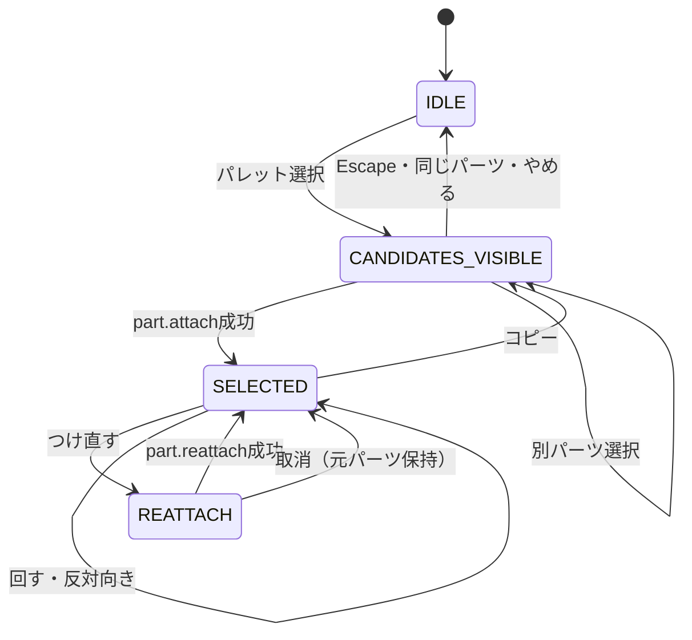

# パーツの配置

LEVEL 1「つくる」の基本操作は「パーツを選んで、光っているところを押してね」です。Panel、Wheel、Block、Motor、Thruster、Wing、Steering、Hingeを同じフローで配置します。空のMachineではPanelの開始位置だけを表示します。

## 状態と責務

`PlacementSession`はStudioのReact状態です。種類、候補、つけ直し元／コピー元IDを保持し、ホバーと画面座標もUI内に閉じます。パレットを押してもCommandを発行しません。コピーも候補確定まで元モデルを変更しません。履歴操作でモデルが変われば候補を再計算します。Play、制作対象やLEVELの変更、新規作成では配置を取り消します。

候補が0件なら「もうタイヤをつけられる場所がないよ」などの案内を出します。候補確定失敗は子ども向けに再選択を案内し、内部Commandは英語の技術エラーを返します。

## Attachment Candidate

`machine-system.findAttachmentCandidates(machine, kind, movingPartId?, sourcePartId?)`はMachineを変更しない純粋関数です。返す値は安定した候補ID、親子パーツの接続先、確定位置、回転、接続軸、fixed／revolute種別です。候補IDは親Part ID・接続先ID・子の種類から生成します。初期位置は`root`です。

接続先のローカル位置を親のScale、Rotation、Positionで変換します。構造パーツなどは面法線と子の寸法・Scaleから接触位置を計算します。回転は親の姿勢を引き継ぎ、接続軸はモデル座標へ変換します。Wheelは既存の4スロットの中心位置を使用します。

つけ直し時は元パーツとその子孫を親候補から除外して循環接続を防ぎ、現在の接続先は再選択できます。元Partは確定まで残ります。コピーは元Partの寸法を使って候補と実体を一致させます。

## Connector Compatibility

Schema v2のConnectorにoptionalな`type`、`accepts`、`normal`を追加しました。旧JSONの読込に必須フィールドは増やしていません。

| 親                  | 接続先            | 接続できるパーツ                     |
| ------------------- | ----------------- | ------------------------------------ |
| Panel               | 従来の0〜3        | Wheel                                |
| Panel               | 上面の2か所       | Panel、Block、Motor、Steering、Hinge |
| Block／Hinge        | 上面の1か所       | Panel、Block、Motor、Steering、Hinge |
| Panel／Block／Hinge | 前後面            | Thruster                             |
| Panel／Block／Hinge | 左右面            | Wing                                 |
| 子パーツ            | mount（Wheelは0） | 取り付け元専用                       |

`placementConnectors()`が旧Connectorの互換性を補完します。候補計算は元モデルを変更せず、確定時だけ必要なConnectorを保存します。既存のID・位置・Axis・明示的な互換性は保持します。接続先は両端の使用状況を調べ、占有済みの場所を候補から除外します。

これは小規模な互換性ルールです。任意の面への配置や部品同士の干渉を解くシステムではありません。Studioで自由編集した形状や、大きなパーツを隣接した場所に置いた場合の重なりは自動解決しません。

## CommandとUndo／Redo

- `part.attach { machineId, partId, kind, candidateId, sourcePartId? }`：最新モデルから候補を再検証し、Part・接続・自動Metadataをまとめて確定します。Part IDはUIで確定し、コピー時は元の色・物理・Actuator設定を保持します。
- `part.reattach { machineId, partId, candidateId }`：IDと詳細設定を保持し、接続先と配置を更新します。子孫も位置・姿勢を一緒に変換します。Wheelのfront／driveは新しい接続先で再計算します。
- `part.turn { machineId, partId, steps }`：1で90度、2で180度回転します。WheelとHingeは接続軸、他はパーツのローカルY軸を使います。子孫と接続軸も変換します。「反対向き」はThrusterに表示します。
- `part.add`、`part.move`、`part.rotate`は継続して利用できます。LEVEL 2／Studioの数値編集と既存テンプレート生成も保持しています。

既存CommandBusのdraft検証とbefore／afterスナップショットを使います。配置、つけ直し、回転は各1 Command／1 Undoです。検証に失敗したCommandはモデルと履歴を変更しません。Redoは確定済みスナップショットを復元するため、ID・姿勢・設定も一致します。

## Wheelの自動設定

Panelのローカル+Z側をfront、-Z側をdriveとして設定します。接続種別はrevolute、初期dampingは0.2。新規WheelのCollider定義はcylinder、massは3、frictionは1.2、restitutionは0.05、motorTorqueは180、steeringは0.45、Actuatorは有効です。Machineの標準操作はW／S／A／Dで、矢印キーと画面ボタンも使えます。

実行時は既存Rapier Raycast Vehicleに渡し、前輪の操舵と後輪の駆動を実行します。Wheelの独立した側面Colliderや実Revolute剛体へ置き換える変更は行っていません。Hingeは既存の実Revolute Jointを使います。

## Rendererと入力

`showAttachmentCandidates(candidates, preview?)`は渡された候補を表示するだけで、接続可能性を判断しません。従来の`showConnectors()`／`connector:`クリックはこのAPIへ統合しました。候補は水色の球＋白い輪＋番号、ホバーで拡大・発光強化と半透明Ghostを表示します。選択中のPartは黄色い枠と発光で区別します。

Raycasterと画面上の最低44pxの補助ヒット領域で候補を選び、`onAttachmentPick(id)`をStudioへ返します。番号には`aria-label`があり、TabでフォーカスしEnterでも確定できます。PointerEventを使い、ドラッグの移動履歴と複数ポインターを考慮してOrbit／Zoomを配置クリックと区別します。

候補とGhostは一時的なSceneオブジェクトです。確定・取消・再読込で破棄し、Project JSONへ入れません。保存対象は確定済みPart・Connection・Metadataのみです。

## 検証

`tests/unit/placement.test.ts`、`tests/integration/placement.test.ts`、`tests/e2e/placement.spec.ts`に計算、確定、Undo／Redo、実走、保存復元、取消、コピー、キーボード、タッチのテストがあります。既存E2Eの直接追加操作は候補クリックを追加し、元の確認項目を維持しています。

画像は`docs/screenshots/placement-01-wheel-candidates.png`、`placement-02-wheel-focused.png`、`placement-03-reattach.png`に保存します。最終結果は[実装報告](placement-report.md)と[evidence/placement-quality-gates.json](evidence/placement-quality-gates.json)を参照してください。
