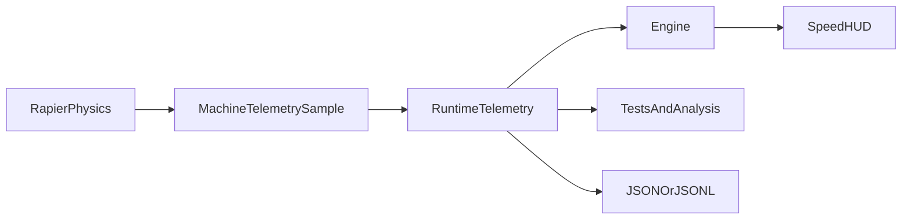

# Runtime Telemetry

## 目的

Runtime Telemetryは、Physicsが持つ実値をLogger、Tests、HUDから共通利用するための実行時専用データです。Project保存データへ履歴を書き戻さず、Physics結果にも影響を与えません。

データフローは次の一方向です。



## 記録単位と項目

- 1 Sampleは1 Machineの1 Physics Stepです。
- Physicsの固定周期は`1/60秒`です。Renderingのフレームレートでは記録しません。
- `step`は1から始まるPhysics Step番号、`timeSeconds`はPhysics経過時間です。
- `position`はWorld座標m、`rotation`はWorld回転Quaternionです。
- `linearVelocityMps`と`angularVelocityRadPerSecond`はRapier RigidBodyの`linvel()`、`angvel()`をそのまま記録します。
- `worldSpeedMps`は線速度の大きさ、`horizontalSpeedMps`はXZ平面の大きさ、`forwardSpeedMps`は機体のWorld +Z方向との内積、`verticalSpeedMps`はWorld Y速度です。
- `throttle`、`steering`、`brake`はそのPhysics Stepに適用した入力です。
- `pitchRad`、`yawRad`、`rollRad`はRigidBody回転から得た姿勢角です。
- `totalLiftN`はPanelごとのLiftベクトルの大きさの合計、`liftVerticalN`はLiftベクトルのY成分の合計です。
- `totalDragN`はPanelごとのDragベクトルの大きさの合計、`totalAerodynamicForceN`は全Panelの合力の大きさです。
- `totalThrusterForceN`は適用したThruster力の大きさの合計です。
- `thrusterForceWorldN`は適用したThruster力のWorldベクトル合計です。Starter Planeでは正のThrottle時に概ね`+Z`になります。
- `averageAngleOfAttackRad`、`averageLiftCoefficient`、`averageDragCoefficient`はそのPhysics Stepで計算した全Panelの単純平均です。Panel単位の常時保存ではなく、前進・後退の符号調査用のMachine集計値です。
- `massKg`はRigidBodyの質量、`weightN`は`massKg * |gravityY|`、`liftToWeightRatio`は`liftVerticalN / weightN`です。
- Landing GearはRapier 0.19.3で確認できる接地状態、サスペンション長、サスペンション力をWheel単位で記録します。`contactStatusAvailable`がfalseの場合、接地状態は取得できません。

Panelごとの詳細値は通常Sampleへ含めません。現在は計算済みPanel値をMachine単位へ集計し、常時ログ量を抑えています。

## Recorder API

`RuntimeTelemetry`は次の操作を提供します。

- `start()`：記録開始
- `stop()`：記録停止
- `clear()`：現在値と記録済みSampleを消去
- `current(machineId?)`：最新のMachine Sampleを取得
- `samples()`：Ring Buffer内のSampleを古い順に取得
- `exportJson()`：`{ version, samples }`形式でJSON出力
- `exportJsonLines()`：1行1SampleのJSON Lines出力

Physicsは記録停止中も最新値を更新しますが、Ring Bufferへは追加しません。通常の長時間実行では記録を明示的に開始してください。既定容量は3600 Samplesです。複数Machineの場合はMachineごとのSampleが1 Stepに追加されるため、容量は全MachineのSample数で消費します。

## Stable Forward Takeoff判定

`findStableForwardTakeoff()`は、Telemetryの時系列から「正しい機首方向へ進みながら地面を離れ、その後も飛行を維持した」区間を探します。候補Sampleでは、接地APIが利用可能で全輪非接地、高度1.5m以上、World速度20m/s以上、`forwardSpeedMps > 0`、Pitch絶対値0.8rad以下を要求します。候補から90 Physics StepのWindow全体でも同じ前進・非接地・Pitch・高度条件を確認し、離陸時より0.5mを超えて下がる区間を除外します。Window終了高度が低い場合も、平均Vertical Speedが-0.5m/s未満なら失敗とします。

接地状態を取得できない場合は安全側に倒し、安定離陸を成功とは判定しません。これにより、バック走行、瞬間的なHop、最高高度に到達した後の落下を通常の前進離陸と混同しません。

## 速度HUD

速度HUDはPlay中だけ表示する通常機能です。デバッグ用の座標差分計算は行わず、同じTelemetry SnapshotのWorld Space Linear Velocityを使います。

```text
worldSpeedMps = sqrt(vx² + vy² + vz²)
speedKph = worldSpeedMps * 3.6
```

内部APIではWind未実装の現在値を`airspeed`とは呼ばず、`worldSpeedMps`と呼びます。Physics値は平滑化せず、HUDは最新Snapshotを表示し、表示単位だけ整数km/hへ変換します。
