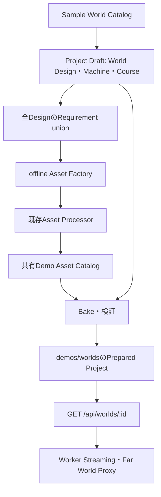

# Sample World Catalog

fresh checkoutで`pnpm install`、`pnpm dev`を実行すると、開始画面に8ワールドが表示されます。カードを選び「▶ あそぶ」で開始します。手動のAsset Factory実行は不要です。「じゆうにつくる」は空のProjectを作る別枠です。

## 構造



`packages/sample-worlds/src/metadata.ts`はID・名前・説明・アイコン・タグ・推奨Machine・表示順だけを公開し、StudioとServerが読み込みます。`builders.ts`はMetadataと生成設定を結び、`buildProject()`を公開します。詳細な島・山・道路の定義は`designs.ts`、準備用Requirementは`prepare.ts`です。`index.ts`は既存利用者向けのBuilder再exportです。Studioのビルドに含まれるSample WorldモジュールはMetadataだけです（[ビルド検証](evidence/sample-worlds-bundle.json)）。

Engineの`world-generator`はDesignを解釈します。World名による8個の分岐もMachine選択の知識も持ちません。新規Presetは汎用の`designed-world`だけです。UIとServerはCatalogを参照します。

## 8ワールド

| ID                   | 表示名           | Starter | Biome                                     | 地形・遊び方                                                    |
| -------------------- | ---------------- | ------- | ----------------------------------------- | --------------------------------------------------------------- |
| starter-grassland    | はじまりの草原   | car     | 既存grassland                             | 旧Generatorの草原、緩い丘、自由走行                             |
| airfield             | 飛行場           | plane   | 既存airfield                              | 旧Generatorの滑走路、離着陸、滑走路上のProp除外                 |
| tropical-archipelago | 南国の群島       | boat    | tropical                                  | 固定配置の5島、明るい砂浜、ヤシ、8棟の村、灯台、海上Spawn       |
| toy-islands          | おもちゃの5島    | car     | temperate / tropical / alpine / grassland | 既存Central・Tropical・Mountain・Airfield・Raceの5島            |
| mountain-island      | 山岳島           | car     | alpine                                    | 半径320mの島、100mの主峰と42mの副峰、山腹道路、観測所と展望地点 |
| desert-island        | 砂漠             | car     | desert                                    | 黄土色の地面、3高台、サボテン、4棟の前哨基地、長い道路、ランプ  |
| snow-island          | 雪山             | car     | snow                                      | 110mの主峰と45mの副峰、雪線、曲がりくねる道路、観測施設         |
| race-island          | レースアイランド | car     | temperate                                 | 閉道路、高低差、Start/Goal、3 Checkpoints、Respawn、ランプ      |

Macro座標はDesignへ保存し、Seedは地形の細部とProp配置を変えます。空・霧・水・照明はProjectに保存します。草原と飛行場は旧Generatorをそのまま使用し、旧archipelagoも保持しています。

Machineは既存の`starterCarTemplate`、`planeTemplate`、`boatTemplate`から選びます。DesignのMachine形状は局所原点に保持し、PhysicsがWorldのSpawnへ置きます。船は海上Spawn、陸上の車・飛行機は地形に接地します。レースのCourseはProject作成時に登録・有効化します。ランプはAsset Slotから一度だけ配置します。

## Biome Surface Profileと保存互換

`packages/world-generator/src/biome-surface.ts`のv1 Catalogにはtemperate、grassland、tropical、alpine、desert、snowがあります。`sampleBiome(x,z)`からProfileを選び、水底・海岸・低地・高地・急斜面・雪線で色を決定します。砂漠には草色を使いません。snowは24m、alpineは78mから雪色です。道路・滑走路には専用色を使います。

**方式A: Bake Manifestの`biomeProfileVersion: 1`で固定**しています。v1の色定義は変更せず、将来は新しい版と明示的な移行を追加します。Schemaは未対応版を拒否します。旧Manifestの省略はv1として扱います。近景ChunkとFar World Proxyの双方がこのProfileを参照し、近景に置き換えたProxy面は既存のChunk単位の除外処理で非表示になります。

HEADには既にProject Schema v7とWorld Design v2、v6 Settlement.assetSlot→buildingRules移行があり、その実装を継承しています。v0～v6の読込み、旧World Designの移行を維持します。新しい`Road.closed`とSettlementの道路距離・scaleRange・rotationModeはoptionalで、省略時は従来動作です。

Worker Contextは既存HEADの内容fingerprintとsnapshot方式を維持します。同じDesignオブジェクトを編集してreloadした場合にWorkerへ新contextを送り、道路・地形cacheを更新する既存回帰テストを実行しています。

## Asset Requirementsと共有ファイル

`planSampleWorldAssets()`は全DesignのPropRules・Landmarks・Settlement buildingRulesを走査して、Slotごとの必要variant数の最大値とBiomeの和集合を作ります。PlannerはLandmarkとSettlementのBiomeも解決するため、例えば観測所はalpineとsnowで共用できます。

使用Slotは次の15種類です。

- nature.tree.temperate / nature.tree.tropical / nature.tree.alpine
- nature.plant.cactus
- nature.rock.small / nature.rock.large / nature.rock.desert / nature.rock.snow
- building.village.house / building.desert.outpost
- landmark.lighthouse / landmark.observatory
- airport.control_tower / course.jump_ramp / road.sign

木・岩などに複数の論理variantがあり、合計45 Asset Recordを105回参照します。形状・色が共通の建物もあるためRuntime GLBは14種類です。

`demos/sample-worlds/library.json`が共有Asset Record、`demos/sample-worlds/assets/<SHA-256>.<ext>`が実ファイルです。Original・Runtime・LOD・Colliderをすべて内容hashで共通化します。Projectには必要SlotのRecordだけを含めます。URLは既存Schemaに適合する`/api/files/sample-worlds/<hash>.<ext>`です。空data directoryからでもServerがリポジトリ内ファイルを直接配信します。

`DummyAstraAssetGenerator(true)`は準備時だけ、プロジェクト所有の単純Primitiveからヤシ・針葉樹・サボテン・岩・建物・灯台・観測所・ランプなどを生成します。既定の引数なしDummyは従来のplaceholderのままです。既存Factory→Processor→Catalogを通し、外部ネットワーク・本物のAstra・課金APIは使いません。RuntimeはPrepared ProjectとローカルGLBを読むだけです。

## デモの再生成と検証

```bash
pnpm sample-worlds:prepare
pnpm sample-worlds:validate
pnpm typecheck
pnpm lint
pnpm cycles
pnpm test
pnpm build
pnpm exec playwright test --config playwright.sample-worlds.config.ts
```

prepareはDraft→Requirement union→offline Factory→ファイル共有化→Bake→`demos/worlds/*.json`を実行します。IDと生成日時を固定して再生成差分を抑えます。validateは毎回現在の`buildProject()`を再生成し、PreparedのWorld/CoursesとManifestの`worldFingerprint`を照合します。さらに`sampleDefinitionFingerprint()`でWorld・Courses・Machines・Settings全体を比較します（AssetとBuild Manifestを除外）。生成結果に新たなstampは保存しません。地形・Machine・設定を変更してprepareし忘れると、再生成コマンド付きのエラーで失敗します。単体テストとAPI統合テストも同じ照合を実行します。続いて全8Projectのparse、Asset解決、World Validator、DesignのBake検証、各100Chunkの生成とNaN検査を実行します。旧2PresetはDesign/Bake対象外で、生成互換テスト・Physics・ブラウザで別途検証します。

結果は`docs/evidence/sample-worlds.json`、ブラウザ観測は`docs/evidence/sample-worlds/`、Playスクリーンショットは`docs/screenshots/sample-worlds/`です。専用Playwright configは毎回空の一時data directoryを作り、localhost通信だけで検証します。Chromiumの既存キャッシュを使う場合は`PLAYWRIGHT_BROWSERS_PATH=$HOME/.cache/ms-playwright`を実行時に指定できます。

旧`asset:plan`、`asset:factory`、`world:validate`、`world:bake`も維持しています。個別Projectは`--project=demos/worlds/desert-island.json`のように指定できます。ServerはCatalogに登録したIDだけを許可し、`.data/worlds/<id>.json`に利用者の準備済み版があれば優先、それ以外は同梱デモを使います。

## 9個目のSample Worldを追加する手順

1. `packages/sample-worlds/src/designs.ts`へWorld Designのfactoryを追加します。島・山・道路・Biome・Spawn保護領域・Landmarkをデータで記述します。
2. `src/metadata.ts`へ固有ID、名前、説明、アイコン、tags、重複しないsortOrder、recommendedMachineを登録し、`src/builders.ts`のconfigurationsへ同じIDで空色、Design factory、必要ならSpawn/Courseを登録します。
3. PropRules・Landmarks・Settlementに必要Asset Slotを記述します。既存Slotを優先して共有し、新しいSlotならDummyのPrimitiveまたはオフライン素材を用意します。
4. Catalog件数テストを9へ更新し、新しいBiome・遊び方・安全性に対するテストを追加します。ブラウザテストのカード件数も更新します。
5. `pnpm sample-worlds:prepare`で共有libraryとPrepared Projectを生成し、成果物をリポジトリへ含めます。
6. `pnpm sample-worlds:validate`と型・単体・統合・ブラウザテストを実行します。

UIやServerへの個別if/route追加は不要です。GeneratorへのWorld名の分岐も不要です。

## 制約

低ポリDemo Assetは識別用であり、完成した専用美術素材ではありません。同じSlot内の論理variantは共通形状です。本物の素材へ差し替える場合は、そのSlotのDummy RecordをProject.assetsから外し、新素材をCatalogへ登録して再Bakeします。既存Manifestは解決候補を固定するため、再Bakeするまでは勝手に素材が変わりません。

道路は地形をSplineの高さへ馴染ませる方式で、壁・橋・トンネルの自動設計はありません。雪の滑りや砂の抵抗などBiome別の物理摩擦は今回追加していません。性能値はNode上の生成時間で、描画FPSとは別です。Biome色の斜面サンプリングによりDesign生成のCPU負荷が増えていますが、Worker Pool・Streaming・Frame Budget・Floating Originは維持しています。ブラウザのソフトウェア描画環境では初期読込みや描画に時間がかかります。

## Biome版と道路生成

`WorldBuildManifest.biomeProfileVersion` → `WorldRuntime` → `GeneratorInput` → `biomeSurfaceCatalog[version]`を接続しています。Far ProxyのWorker要求にも同じ版を渡します。省略はv1、未対応の版は明示的なエラーです。Manifestの版を変えてreloadすると生成ContextとChunk cacheも更新します。将来版は既存Profileを変更せずCatalogに追加します。

`sampleTerrain(x,z)`が高さ・道路影響・Biomeをまとめ、頂点ごとの道路距離の二重計算を避けます。影響計算は32m格子に登録した近傍線分だけを走査します。幅・減衰幅が異なる交差道路も既存の最近傍優先規則と同距離の選択順を維持します。Prop配置などが使う全域の正確な道路距離検索は従来の全線分走査です。

`pnpm exec tsx scripts/sample-road-benchmark.ts`は旧二重走査と新実装を同一プロセスで交互に測定し、各100Chunkの地形・色・配置が一致することも検証します。道路を10倍に延ばしても同じ近傍Chunkの線分照合数が増えない回帰テストを含みます。

## 実走E2E

専用Playwright configは8ワールドの読込み検査に加え、草原と砂漠の車が30m進むこと、南国のボートが推進中も水面付近を維持して30m進むことを検証します。レースは経路を見て通常のキー入力で運転し、3CheckpointとGoalを順に通過します。テストからMachineの位置・速度・Course進捗を書き換えません。実走記録は`docs/evidence/sample-worlds/*-drive.json`です。
