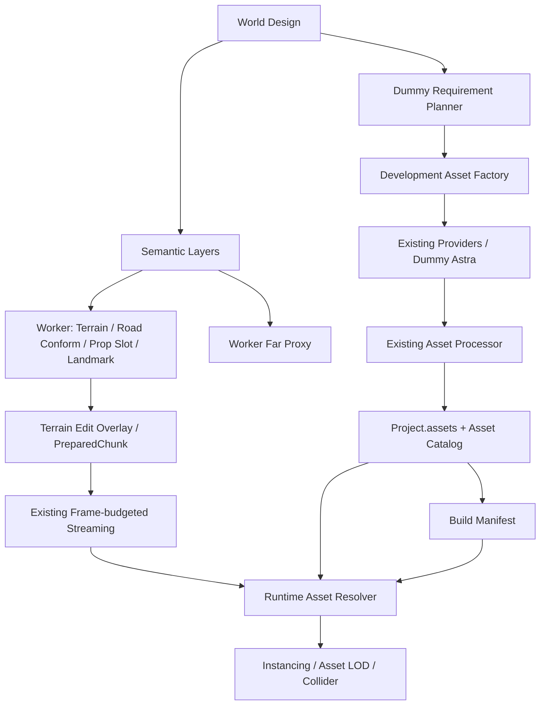
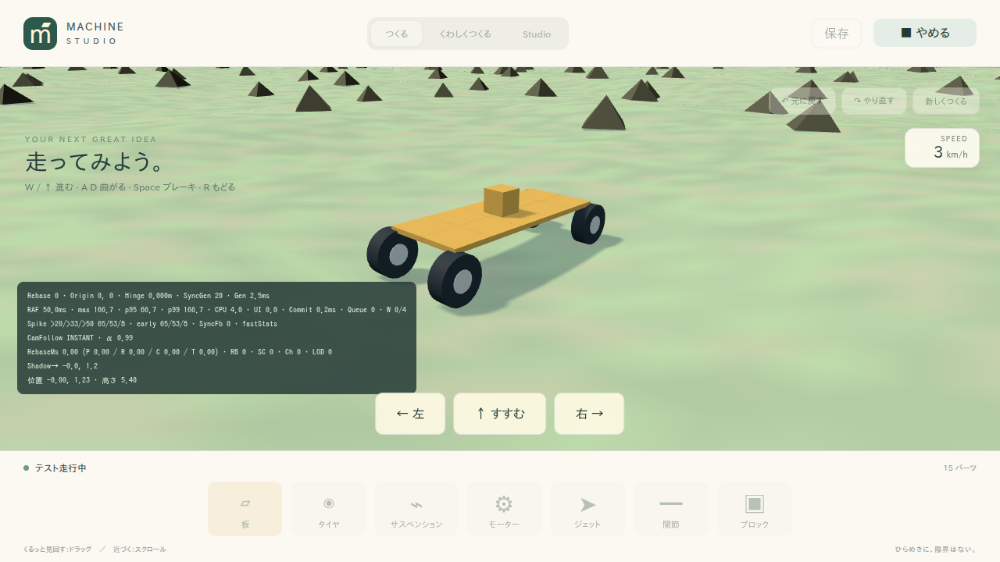
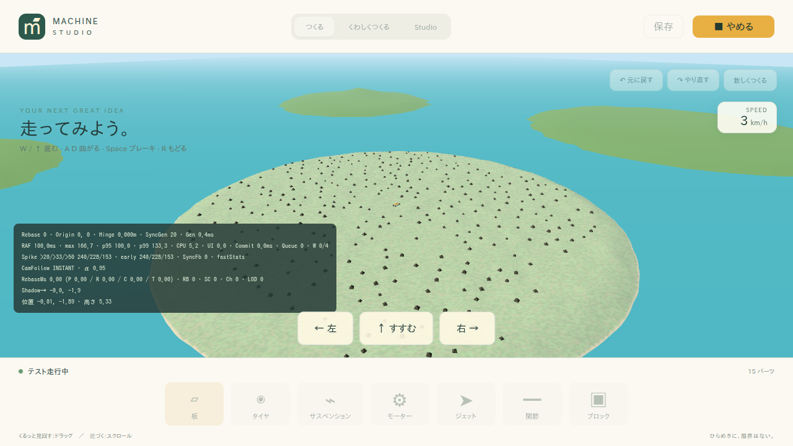

# 指示17：World生成基盤 / Asset Factory 実装報告

作業ブランチ：`feat/world-generation-asset-factory`
ベース：`perf/async-world-streaming-frame-budget` / `006e006af6387f736ac134ac2a87604767599d75`

## 1. 実装概要

World Designに基づく決定的な5島ワールド、共通Semantic Layers、道路地形conform、制約付きProp配置、Asset Catalog/Resolver、開発用Factory、Dummy Planner/Astra、安全なZIP取込、Bake、Validator、Worker遠景Proxyを追加しました。Runtimeは保存済みCatalogとAssetファイルだけを利用します。既存のWorker Pool、32m Streaming、フレーム予算、Floating Origin、Terrain Edit、Tombstoneを維持しています。

ambientCGのPBR ZIPはTexture Assetとして原本・画像群を保持し、Renderer未対応を明示します。GLBへの偽変換、Material推測、本物のAstra呼び出しは行いません。

## 2. Architecture



依存方向とPackage cycleは`pnpm cycles`で確認済みです。さらにmadgeの依存グラフを辿り、World Generator・World Runtime・PlayerからFactory/Provider/Processorへの到達経路がないことを確認しました。Node専用のDummy Asset Generatorは`ai-dummy/asset-generator`サブパスとし、既存のブラウザ用Dummy AI入口へ混ぜていません。

## 3–4. 追加・変更ファイル

ファイル一覧は末尾に記載します。主要な追加は`asset-catalog`、`asset-factory`、World Design Schema、Generator内部のSampler/配置/Validator/Proxyです。既存Renderer・Physics・Engine・Worker・Provider・Processorには接続に必要な変更を加えています。

## 5–6. Schema / Migration

CURRENT_SCHEMA_VERSIONは6を維持。追加フィールドは`source.design`、`world.buildManifest`、`asset.catalog`、`asset.textureInfo`です。v6データの変換は不要で、従来のv0–v5 migrationも継続します。旧3プリセットはGenerator v1、新しいtoy-islandsはv2です。

World DesignはZodで明示的に型付けし、任意Recordへ押し込んでいません。Duplicate Design ID、不正range、危険なAsset配置参照等を検査します。

## 7. World generation pipeline

Design固定の島・山→海岸と弱いseed detail→道路/集落/滑走路conform→PropのSemantic条件/halo neighbour rejection→固定Landmark→編集差分→Worker mesh→既存queue/commit→Catalog解決です。生成IDはseed/version/semantic type/stable cellから作り、削除済みEntityをTombstoneで除外します。

DesignはWorkerにcontextとして渡し、Chunkごとの大きなコピーを避けます。近景の表示変更時だけ遠景indexを更新します。World Design経路のマシンは局所形状を維持し、Bodyを指定Spawnの標高へ置きます。

## 8. Asset Factory pipeline

Catalog不足判定→local→kenney→polyhaven→ambientcg→kaykit-local→dummy-astra→既存Processor→Catalog登録です。offlineはCatalog/Local/Dummyのみ、dry-runは不足照会のみ、acquireは許可Providerを利用可能です。

CLIは既存`library.json`のmodelをLocal Libraryとして検索し、必要なファイルだけ読み込みます。CC0/project-owned以外を自動採用せず、source/author/license/sourceUrl/retrievedAtを保持します。原本は既存ファイルと一致する場合のみ再利用し、異なる内容の上書きは拒否します。

ZIPはpath traversal、symlink、展開量、件数、nested archive、CRC、拡張子/MIMEを検査します。GLB/glTF入りは通常Pipelineへ、画像のみはTexture/unsupportedへ分岐します。

## 9–10. Dummy仕様

PlannerはDesignのPropRules/Landmarks/Settlementsを走査し、Slotの集合を作ります。木5、岩4、building3、jump_ramp3、その他1 variantです。

Astra Dummyは既存`placeholderGlb()`を使い、provider=`dummy-astra`、model=`dummy`を記録します。生成入力hashとvariant IDを区別しますが、外観は共通placeholderです。ネットワーク、OpenAI key、課金API、Blender自動操作は不要です。

## 11. toy-islands

中央草原・熱帯・山岳・空港・レースの5島をDesignに固定しました。中央Spawn、小さな町、灯台、観測所、滑走路、管制塔、ジャンプ台、標識を持ち、CLIは道路に沿ったレースコースも作ります。細部とPropだけseedで変化します。

10 Slot / 28 Dummy Assetをofflineで準備でき、全島の1,183 EntityをValidatorへ通してerror/warningとも0でした。Studioの開始画面から用意済みProjectを読み込めます。

近景・遠景の実ブラウザ画像：





## 12–13. Test / Build

| 検証                            | 結果                                                      |
| ------------------------------- | --------------------------------------------------------- |
| `pnpm typecheck`                | PASS                                                      |
| `pnpm lint` / `pnpm cycles`     | PASS、循環なし                                            |
| `pnpm test`                     | 37 files / 282 tests PASS                                 |
| `pnpm build`                    | Studio / Player / Server PASS                             |
| `asset:plan` / offline Factory  | 10 Slot、28登録。再実行は登録0・不足0                     |
| `world:validate` / `world:bake` | PASS                                                      |
| 新規toy-islands E2E             | PASS、実Worker・5 Proxy・地表接地・ローカル通信のみを確認 |
| 全E2E                           | 30 PASS / 4 FAIL                                          |
| `pnpm smoke`                    | 18 PASS / 1 FAIL                                          |

既存テストを削除・skipせず実行しました。全E2Eで失敗した4件のうち、次の3件はベースブランチの隔離worktreeでも再現しています。

- `spike-flight-diagnostics`：フレーム計測の浮動小数値を完全一致で比較し失敗。ベースでも`50.099999999999454`と`50.100000000000364`の差で失敗。
- `spike-prewarm-diagnostics`：page/dialogがdetachされた状態でのnavigation/処理エラー。
- `world-runtime`：ゴール待ちtimeoutと`undefined.isReady`。ベースでも同じfailure。smokeの失敗もこの1件です。

残る`runtime-stability`は初回カメラtarget差`9.449 > 8`で失敗しましたが、ベース比較と今回ブランチの単独再実行は成功しました。タイミングに依存する結果として記録し、全E2Eがgreenとは報告しません。

Buildには既存のZod annotation、bundleサイズ、Rapier初期化の警告が残ります。記録は[check summary](evidence/world-generation-checks.json)を参照してください。

## 14. Performance

ベースと既存各100 Chunkを比較し、高度配列、色、Entity、chunk hashが完全一致しました。Node同期計測の中央値は草原約0.20ms、空港約0.14ms、群島約0.17msで、変更前後は同程度です。p95には0.1ms台の測定変動があります。

新toy-islandsは中央値約2.09ms、p95約2.98ms、最大約3.39msです。制約判定とProp数が増えるため、従来の単純Generatorの約10–15倍です。実ブラウザではWorkerで生成し、Main Threadへ戻していません。

[生成時間の比較](evidence/world-generation-performance.json)はNode計測であり、WebGL/frame時間は含みません。[ブラウザ観測](evidence/toy-islands-browser.json)では5 Proxy、169 render chunk、49 physics chunk、4輪接地を確認しました。この環境はsoftware WebGLで、GPU/frame時間には大きな遅延があり、60fps達成を証明する結果ではありません。生成改善とGPU描画性能を同じ数値として扱っていません。

## 15. 既知の制約

- Dummyの外観は未完成。実際の木・灯台等のモデルは今後の採用対象です。
- Real Planner、Real Astra、Real Blender computer-useは意図的に未実装。
- PBR texture setは保存可能、Renderer未対応。PNG/JPEG/WebPに限定し、ZIP64/暗号化/その他archive方式も未対応です。
- Mid専用地形LODは未追加。Farは地形のみでProp/編集差分は近景へ反映します。
- 外部Providerのacquire実通信は検証していません。候補styleはタグであり、外観の自動審査はありません。
- Bakeはファイル生成時SHA-256とmetadata hashを保持しますが、Runtimeの配信ファイルを毎回再hashしません。
- E2Eの既存失敗は上記のとおり残っています。

## 16–17. 将来の接続箇所

Real Plannerは`asset-factory/src/planner.ts`の`AssetRequirementPlanner`を実装します。Real Astraは`asset-core/src/index.ts`の`AssetGenerator`を実装し、Factory constructorへ注入します。Dummy→Processor→Catalogは実際に動作・検証されているため、RuntimeへAI依存を持ち込む必要はありません。

## 18. 実行方法

```bash
pnpm asset:plan
pnpm asset:factory -- --mode=dry-run
pnpm asset:factory -- --mode=offline
pnpm world:validate
pnpm world:bake
pnpm dev
```

Studioの「おもちゃの群島」を選択してください。既定保存先は`.data/worlds/toy-islands.json`、Assetは`.data/assets`です。この作業環境では準備済みです。詳細は[World生成](world-generation.md)、[Asset Factory](asset-factory.md)を参照してください。

## 最終レビュー

既存v1生成の式、seed派生、ID方式は維持しました。Project.assetsの二重管理、Runtime→Factory/Provider依存、課金AI呼び出しは追加していません。テストが書き換えた既存screenshots/evidenceは元へ戻し、今回の生成・ブラウザ証拠だけを追加しました。

## 追加ファイル一覧

- [docs/asset-factory.md](../docs/asset-factory.md)
- [docs/evidence/toy-islands-browser.json](../docs/evidence/toy-islands-browser.json)
- [docs/evidence/world-generation-checks.json](../docs/evidence/world-generation-checks.json)
- [docs/evidence/world-generation-performance.json](../docs/evidence/world-generation-performance.json)
- [docs/screenshots/toy-islands-far.png](../docs/screenshots/toy-islands-far.png)
- [docs/screenshots/toy-islands.png](../docs/screenshots/toy-islands.png)
- [docs/world-generation-asset-factory-report.md](../docs/world-generation-asset-factory-report.md)
- [docs/world-generation.md](../docs/world-generation.md)
- [packages/ai-dummy/src/asset-generator.ts](../packages/ai-dummy/src/asset-generator.ts)
- [packages/asset-catalog/package.json](../packages/asset-catalog/package.json)
- [packages/asset-catalog/src/index.ts](../packages/asset-catalog/src/index.ts)
- [packages/asset-factory/package.json](../packages/asset-factory/package.json)
- [packages/asset-factory/src/bake.ts](../packages/asset-factory/src/bake.ts)
- [packages/asset-factory/src/index.ts](../packages/asset-factory/src/index.ts)
- [packages/asset-factory/src/planner.ts](../packages/asset-factory/src/planner.ts)
- [packages/asset-pipeline/src/archive.ts](../packages/asset-pipeline/src/archive.ts)
- [packages/project-schema/src/world-design.ts](../packages/project-schema/src/world-design.ts)
- [packages/renderer-three/src/far-proxy.ts](../packages/renderer-three/src/far-proxy.ts)
- [packages/world-generator/src/design-generation.ts](../packages/world-generator/src/design-generation.ts)
- [packages/world-generator/src/far-proxy.ts](../packages/world-generator/src/far-proxy.ts)
- [packages/world-generator/src/seed.ts](../packages/world-generator/src/seed.ts)
- [packages/world-generator/src/semantic.ts](../packages/world-generator/src/semantic.ts)
- [packages/world-generator/src/toy-islands.ts](../packages/world-generator/src/toy-islands.ts)
- [packages/world-generator/src/types.ts](../packages/world-generator/src/types.ts)
- [packages/world-generator/src/validate.ts](../packages/world-generator/src/validate.ts)
- [scripts/world-performance.ts](../scripts/world-performance.ts)
- [scripts/world-tools.ts](../scripts/world-tools.ts)
- [tests/e2e/toy-islands.spec.ts](../tests/e2e/toy-islands.spec.ts)
- [tests/fixtures/asset-factory.ts](../tests/fixtures/asset-factory.ts)
- [tests/integration/asset-factory.test.ts](../tests/integration/asset-factory.test.ts)
- [tests/integration/toy-islands-physics.test.ts](../tests/integration/toy-islands-physics.test.ts)
- [tests/unit/asset-archive.test.ts](../tests/unit/asset-archive.test.ts)
- [tests/unit/world-design.test.ts](../tests/unit/world-design.test.ts)

## 変更ファイル一覧

- [KNOWN_ISSUES.md](../KNOWN_ISSUES.md)
- [README.md](../README.md)
- [apps/server/src/app.ts](../apps/server/src/app.ts)
- [apps/studio/src/main.tsx](../apps/studio/src/main.tsx)
- [package.json](../package.json)
- [packages/ai-dummy/package.json](../packages/ai-dummy/package.json)
- [packages/asset-core/src/index.ts](../packages/asset-core/src/index.ts)
- [packages/asset-pipeline/src/index.ts](../packages/asset-pipeline/src/index.ts)
- [packages/asset-providers/src/index.ts](../packages/asset-providers/src/index.ts)
- [packages/command-system/src/index.ts](../packages/command-system/src/index.ts)
- [packages/engine-core/package.json](../packages/engine-core/package.json)
- [packages/engine-core/src/agent-observation.ts](../packages/engine-core/src/agent-observation.ts)
- [packages/engine-core/src/index.ts](../packages/engine-core/src/index.ts)
- [packages/physics-rapier/src/index.ts](../packages/physics-rapier/src/index.ts)
- [packages/project-schema/src/index.ts](../packages/project-schema/src/index.ts)
- [packages/renderer-three/src/index.ts](../packages/renderer-three/src/index.ts)
- [packages/ui-studio/src/index.tsx](../packages/ui-studio/src/index.tsx)
- [packages/world-generator/src/index.ts](../packages/world-generator/src/index.ts)
- [packages/world-generator/src/worker-entry.ts](../packages/world-generator/src/worker-entry.ts)
- [packages/world-system/package.json](../packages/world-system/package.json)
- [packages/world-system/src/chunk-worker-pool.ts](../packages/world-system/src/chunk-worker-pool.ts)
- [packages/world-system/src/runtime.ts](../packages/world-system/src/runtime.ts)
- [pnpm-lock.yaml](../pnpm-lock.yaml)
