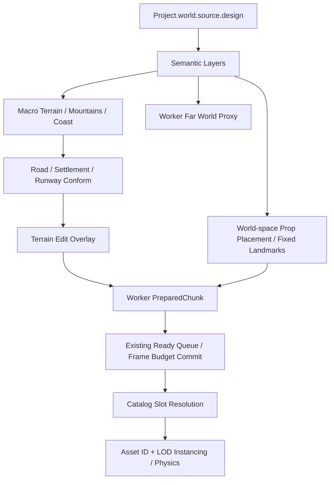

# World Designによるワールド生成

`toy-islands`は保存済みのWorld Designを使うGenerator v2です。従来の`grassland`、`airfield`、`archipelago`はv1の地形、seed派生、Entity IDを維持します。Project Schemaはv7です。従来のv6は読込時に移行し、新しい永続データ契約を明確に区別します。



## 保存データと互換性

`packages/project-schema/src/world-design.ts`が型とZod検証を提供します。World Designは島、山、Catmull-Rom道路、集落、回転付き滑走路、固定Landmark、Biome領域、No-Spawn領域、Gameplay領域を保持します。PropRuleにはSlot、Biome、密度、標高、傾斜角度（度）、道路・水・Landmarkからの距離、最小間隔、scale範囲、yaw方針があります。

`source.design`、`world.buildManifest`、`asset.catalog`、`asset.textureInfo`は追加の任意フィールドです。v0–v6のmigrationを継続します。旧Settlement.assetSlotはbuildingRulesへ移行し、同位置・同Slotの固定Landmarkがある場合は重複生成を避けます。Designを変換したProjectのBuild Manifestは無効化するため再Bakeが必要です。toy-islandsにはWorld Designを必須とし、欠損時に従来草原へ黙ってフォールバックしません。

## Macro / Meso / Micro

- Macro：5島の中心・半径・海岸幅と山はDesignに固定します。
- Meso：道路、集落、滑走路、Biome、Landmark、配置禁止領域を共通Samplerで評価します。
- Micro：弱い補間ノイズと、world-space cellのjitterから配置とscale/yawを生成します。

32m Chunkと33×33高度配列、既存のWorker Pool、非同期queue、Floating Originを維持します。constructor/reload時に`fingerprint({ generatorVersion, worldDesign })`を計算し、内容が変わればDesign snapshotを作って全Workerへcontextを送ります。同じオブジェクトを直接変更してreloadしても更新され、変更がなければ再送しません。各Chunk jobではhashを渡し、Designの再hashや複製をしません。Main ThreadのSamplerとSpline cacheも同じsnapshotへ切り替えます。reload前に直接変更した内容は生成へ反映しません。

## Semantic Layers

`SemanticLayers`はworld座標`(x,z)`からIsland/Height/Coast/Biome/Road/Settlement/Landmark/No-Spawn/Gameplay/Runwayを決定的にサンプルします。Generator、Validator、遠景が同じSamplerを使います。巨大なRasterは保存しません。

地形は海底を基準に、Designの島台地・海岸遷移・山・弱いseed detailを合成し、道路→集落→滑走路の順にconformします。最後に既存`prepareChunk()`がTerrain Edit Overlayの高度差分・色を適用してmesh/normalを作ります。再生成で編集差分を削除しません。

## Road Conform

道路はCatmull-Romの制御点列です。道路中心の目標高度は`absolute`なら制御点のY、`terrain`なら共通地形Samplerです。道幅内・路肩は目標高度へ寄せ、terrainFalloffをsmoothstepで補間します。座標サンプルで計算するため、Chunk読み込み順や境界に依存しません。地表色で道路を表示します。

## Prop Placement

配置候補は島・Slot・rule index・world cellをキーに作ります。候補の密度、jitter、優先度、scale、yawは別々のseed namespaceです。隣接Chunkを含む最大spacing幅のhaloを評価し、近隣の優先度が高い候補がある点を棄却します。異なるrule同士でも大きい方の間隔を守ります。

Biome、標高、水面上、傾斜、海岸からの保守的距離、道路端からの距離、Landmark距離、No-Spawn、集落、滑走路を検査します。LandmarkはDesignに固定され、`snapToTerrain=true`のときだけterrain高度にposition.yのoffsetを足します。

生成物の主参照は`assetSlot`です。RuntimeのCatalog Resolverが一度解決して`assetId`を付け、同じAsset IDを既存のWorldAssetBatch/LODへまとめます。未解決時は`missingAsset=true`を保持し、互換kindの表示を使います。ValidatorはMissingAssetをerrorにします。Tombstoneは安定IDに対して従来どおり適用します。

## Settlementの建物配置

Settlementは地形の平坦化、自然Propの配置禁止、`buildingRules: [{ assetSlot, count, minSpacing }]`を持ちます。町全体のcell候補をseedで決定し、道路・明示No-Spawn・滑走路・水面・傾斜・Landmark・他の建物との間隔を検査してからChunkへ分配します。町自身のNo-Spawnだけは町の建物に限って除外します。

PlannerとValidatorはbuildingRulesのSlotを参照し、Catalog解決・Instancing・Colliderは既存Propと共通です。要求数を配置できない場合はValidatorが`settlement-building-count`エラーを出します。探索は1 Ruleあたり10万cellまでで、上限超過も不足として報告します。toy-islands Design v2は町に8棟、最小間隔12mを配置し、以前のLandmarkの家は含めません。旧保存Worldの家はmigrationで保持します。

## Seed Namespace

`deriveSeed(worldSeed, namespace, stableId)`は型を含む入力から32bit値を生成します。v2はterrain/prop/density/jitter/priority/scale/rotation等を分離しています。v1の`seed + 9`等は既存出力を保存するため意図的に変更していません。rule順序を変える変更は配置IDにも影響するため、完成WorldではBakeを更新してください。

## Far World Proxy

通常Chunkの外側は、各島の32m cellに揃えた低解像度meshで表示します。各島1meshで、専用Workerが生成します。表示済み近景Chunkのcellに対応する遠景三角形を除外し、二重描画を避けます。近景が消えると遠景cellが戻ります。Far Groupの位置はFloating Originに追従します。

現段階はNear=通常Chunk、Far=低解像度Proxyです。独立したMid専用mesh/地形LOD遷移の追加は行っていません。遠景にはPropやTerrain Editの細部を描きません。編集差分は近景で反映します。

## Validator / Debug

`validateWorld()`はSpawn水没・地下、道路急勾配、滑走路/No-SpawnへのProp侵入、木の水没、Landmark水没、必須Slot不足、Settlement建物の配置可能数、島の有効陸地、Checkpoint位置をerror/warning/infoで報告します。呼び出し側が渡した配置群を検証します。CLIは全島のChunkを走査します。自動repairはしません。

開発時、または`?agent=1`で以下をブラウザconsoleから参照できます。

```js
window.__MACHINE_STUDIO_AGENT__.getWorldDesignDebug(64, 64);
```

Island mask、Biome、道路影響、No-Spawn、高さ、Chunk bounds、生成点、Asset Slot、解決Asset ID、MissingAsset、Far Proxy数を返します。通常のAgent API無効時にはwindowへ公開しません。

## toy-islands

| 島       | 中心 X/Z    | 半径 | 内容                                        |
| -------- | ----------- | ---- | ------------------------------------------- |
| central  | 0 / 0       | 190m | 温帯草原、町、Spawn                         |
| tropical | 470 / 220   | 165m | 海岸、熱帯樹木、灯台                        |
| mountain | -430 / 310  | 200m | 高さ85mの山、岩、観測所                     |
| airfield | 120 / -470  | 220m | 幅28m・長さ270mの滑走路、管制塔             |
| race     | -410 / -340 | 175m | 丘、道路、ジャンプ台、標識、CLIが作るコース |

World Design経路ではマシン形状を局所原点付近に保ち、Physics BodyをWorldのSpawnへ置きます。既存3プリセットの初期Body配置は変更しません。テストデモのモデルはDummy共通形状で、樹木や灯台の完成モデルではありません。

## 実行

```bash
pnpm asset:plan
pnpm asset:factory -- --mode=dry-run
pnpm asset:factory -- --mode=offline
pnpm world:validate
pnpm world:bake
pnpm dev
```

Studio起動時の「おもちゃの5島」から`.data/worlds/toy-islands.json`を読み込み、なければ同梱`demos/worlds/toy-islands.json`を使用します。APIは用意済みProjectを読むだけで、RuntimeからFactoryを呼びません。

## 今後の改善

自然Propの近傍判定は候補配列の走査です。高密度の森ではSpatial Hash化を検討します。Biome Surface Profileと閉道路、共有Sample World Catalogは[指示18の構造](sample-worlds.md)を参照してください。近景と遠景の色にBiomeを反映します。
