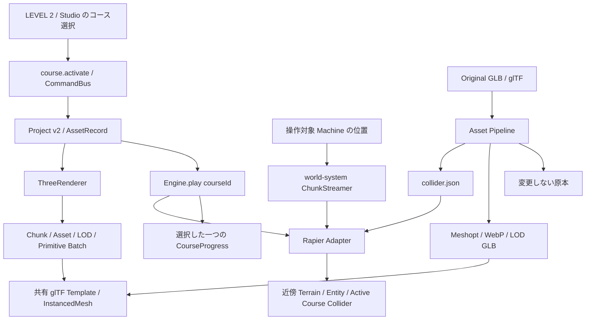

# 指示2 実装報告

作業ブランチ: `feat/world-runtime-foundations`。基準コミット: `bc77656`。指定された6項目を実装し、既存の3段階UI、Machine Builder、各Editor、Asset Browser、Raycast Vehicle、保存／読込、Command、Dummy AI、Playerを維持しました。指定の完成条件28項目を確認し、今回の判定は **COMPLETE** です。

## 1. 実装概要

| 対象                          | 変更内容                                                                                                                                            |
| ----------------------------- | --------------------------------------------------------------------------------------------------------------------------------------------------- |
| World Physics Chunk Streaming | TerrainをチャンクTrimesh化。World Entityと選択コースの道路・障害物も空間索引へ登録。Machine位置でロード／破棄し、先行ロードと保持半径で境界を保護。 |
| Instanced Rendering           | チャンク×素材×LOD×PrimitiveでInstancedMeshを構築。glTF Templateを参照数で共有し、instanceIdからEntityへ逆引き。                                     |
| LOD                           | Import時にLOD0／LOD1／LOD2を生成。実際の距離切替、10%ヒステリシス、読込中の現在形状保持。非対応モデルはLOD0へ復帰。                                 |
| World Asset Collider          | box／convexHull／trimeshと別ファイルのCollider Geometry。素材単位キャッシュ、配置変換、破損・退化HullのBoxフォールバック。                          |
| Runtime最適化・容量設計       | Original保持、3 Profile、Meshopt／WebP、原本から再生成。Binary Upload、設定可能な安全上限、StorageとRuntime予算を分離。                             |
| 複数Course選択                | settings.activeCourseId、course.activate、Undo／Redo、選択UI、Engineの明示API。選択コースだけで進行・描画・物理を実行。                             |

## 2. Architecture

World Systemはチャンクの選択と寿命、Rapier AdapterはCollider生成・削除、RendererはTemplate・Batch・LODを担当します。ライブラリの実行オブジェクトをProjectへ混入させていません。

複数チャンクにまたがるColliderは参照数で共有します。新規チャンクをロードした後に不要分を削除し、Vehicle更新より先に実行します。Heightfieldへの変換ではなく、既存の地形セルとの継ぎ目を一致させるチャンクTrimeshを採用しました。

Rendererは選択LODのPrimitiveごとにバッチを作り、Node階層変換とEntity変換を合成します。テンプレートの最後の参照が消えると共有GPUリソースを解放します。負の変換やSkin等は通常描画へ戻します。LODの古い非同期応答や停止後のPhysics読込結果は採用しません。

Import安全上限はServer設定、保存容量はLocalAssetStorage、現在のロード量の予算はRendererという責務に分けました。安全検査は削除せず、デコード前の宣言サイズ検査と失敗時の途中ファイル回収も追加しました。

## 3. 変更ファイル

主要変更は以下です。末尾にGit差分のファイル一覧を収録しています。

- Schema／Command／Engine: `packages/project-schema/src/index.ts`、`packages/command-system/src/index.ts`、`packages/engine-core/src/index.ts`。
- Streaming／Physics: `packages/world-system/src/streaming.ts`、`packages/physics-rapier/src/index.ts`。
- Renderer: `packages/renderer-three/src/index.ts`、`instances.ts`。
- Asset: `packages/asset-core/src/{collider,profiles,limits}.ts`、`packages/asset-pipeline/src/{index,runtime,safety}.ts`、`packages/asset-providers/src/index.ts`、`packages/storage/src/local.ts`。
- UI／API: `apps/studio/src/main.tsx`、`packages/ui-studio/src/index.tsx`、`apps/server/src/app.ts`。
- 検証: `world-runtime.test.ts`、`world-streaming.test.ts`、`runtime-pipeline.test.ts`、`world-runtime.spec.ts`、追加Fixture、Benchmark／品質ゲートスクリプト。
- 文書・設定: 指定のREADME／KNOWN_ISSUES／各システム文書、`.env.example`、依存ManifestとLockfile、証拠JSON／ログ。

## 4. Schema Migration

v0→v1→v2を維持しました。v0では不足したmissionsを補完し、v1では最初のCourse IDまたはnullをactiveCourseIdへ設定します。runtimeProfileの既定値はbalancedです。

AssetRecordにCollider方式・ファイル・サイズ、LODファイル・三角形数・距離・サイズ、Optimization情報を追加しました。旧`collider: "box"`、`lodLevels: [0]`、`runtime.glb`も有効です。旧Assetを勝手に再Importしません。

3つの既存デモを移行し、保存→再読込で一致することを確認しています。詳細は[project-schema.md](project-schema.md)を参照してください。

## 5. テスト結果

品質ゲートの確定値は[evidence/world-runtime-quality-gates.json](evidence/world-runtime-quality-gates.json)です。既存テストは削除していません。既存のv0移行テストの期待schemaVersionだけを1から2へ更新しました。

| チェック    | 結果 | 件数・証拠                                                          |
| ----------- | ---- | ------------------------------------------------------------------- |
| typecheck   | PASS | workspace全体・[ログ](evidence/world-runtime-typecheck.log)         |
| lint        | PASS | 循環依存なし・[ログ](evidence/world-runtime-lint.log)               |
| format      | PASS | コード・テスト・更新文書・[ログ](evidence/world-runtime-format.log) |
| unit        | PASS | 28件・[ログ](evidence/world-runtime-unit.log)                       |
| integration | PASS | 19件・[ログ](evidence/world-runtime-integration.log)                |
| test        | PASS | 47件・[ログ](evidence/world-runtime-test.log)                       |
| build       | PASS | Studio／Player／Server・[ログ](evidence/world-runtime-build.log)    |
| e2e         | PASS | Chromium 11件・[ログ](evidence/world-runtime-e2e.log)               |
| smoke       | PASS | 9件・[ログ](evidence/world-runtime-smoke.log)                       |

## 6. Performance比較

Chromium SwiftShader／1280×720／同一Benchmark World。Beforeは元コミットの実ビルド、Afterは今回の本番ビルドです。

| 指標                             |        Before |        After |
| -------------------------------- | ------------: | -----------: |
| Draw Calls                       |           219 |           32 |
| 描画Triangles                    |        16,708 |       30,668 |
| 描画Chunks                       |            25 |           25 |
| Physics Chunks                   | 0（一括生成） |           25 |
| Colliders                        |         1,503 |          526 |
| 同じ外部素材のRuntime LOD0サイズ | 286,324 bytes | 38,896 bytes |
| 同素材のLOD0 triangles           |         3,968 |        3,968 |
| 同素材のLOD1 triangles           |          なし |        1,785 |
| 同素材のLOD2 triangles           |          なし |          475 |

Draw Callsを約85%、外部素材のLOD0サイズを約86%削減しました。World内の遠方Entity1,000個はColliderを保持しません。別の900 EntityワールドではMachineの遠距離往復でも各地点62 Colliderを維持します。

描画Trianglesはこの画角では増加しています。Instancingで判定が個体単位からBatch単位になるためです。外部素材の遠距離LODでは形状の三角形数が減ります。Worldの内蔵岩Benchmark自体には外部Runtimeファイルがないため、Runtimeサイズ比較は別の同一GLB検証として区別しています。

詳しい条件と生データは[performance.md](performance.md)を参照してください。実GPUやモバイルの性能保証ではありません。

## 7. 完成条件チェック

| Requirement                                 | Status | Evidence                                                                     |
| ------------------------------------------- | ------ | ---------------------------------------------------------------------------- |
| Terrain PhysicsのチャンクLoad／Unload       | PASS   | [チャンクTrimeshと物理移動テスト](world-system.md)                           |
| World Entity ColliderのチャンクLoad／Unload | PASS   | [900 Entity Worldの往復](evidence/physics-streaming.json)                    |
| Machine位置を基準にPhysics更新              | PASS   | [Vehicle更新前の位置参照](../packages/physics-rapier/src/index.ts)           |
| 境界でTerrainをすり抜けない                 | PASS   | [境界通過中の毎Step検査](../tests/integration/world-streaming.test.ts)       |
| 同一World AssetのBatch描画                  | PASS   | [実InstancedMeshと共有Template](../packages/renderer-three/src/instances.ts) |
| Draw Call削減Evidence                       | PASS   | [219→32](evidence/performance-after.json)                                    |
| Asset LOD0／LOD1／LOD2生成                  | PASS   | [実ファイル生成とデコード](evidence/runtime-optimization.json)               |
| DistanceによるLOD切替                       | PASS   | [本番表示のLOD別Batch数](../tests/e2e/world-runtime.spec.ts)                 |
| Original Assetを変更しない                  | PASS   | [バイト一致・ハッシュ一致](../tests/integration/runtime-pipeline.test.ts)    |
| Runtime Assetだけ最適化                     | PASS   | [原本と実行ファイルを分離](asset-pipeline.md)                                |
| box／convexHull／trimesh                    | PASS   | [実Rapier ShapeType検査](../tests/integration/runtime-pipeline.test.ts)      |
| TerrainでHeightfieldまたはChunk Trimesh     | PASS   | [Chunk Trimesh採用](../packages/physics-rapier/src/index.ts)                 |
| Collider生成失敗時Boxへ復帰                 | PASS   | [破損Source・退化Hull](../tests/integration/runtime-pipeline.test.ts)        |
| 固定4MB Upload制限の廃止                    | PASS   | [5MiB超のBinary GLB取込](../tests/integration/runtime-pipeline.test.ts)      |
| 固定64MB Aggregate製品制限の廃止            | PASS   | [環境変数で総量を設定](../packages/asset-core/src/limits.ts)                 |
| 設定可能なSafety Limitを維持                | PASS   | [容量・展開サイズ・寸法・Geometry](asset-pipeline.md)                        |
| StorageとRuntime予算の分離                  | PASS   | [保存容量と現在の描画量を別評価](performance.md)                             |
| activeCourseIdを保存                        | PASS   | [v2 settingsとRound-trip](project-schema.md)                                 |
| 複数CourseからPlay対象を選択                | PASS   | [B選択・保存・Reload・完走](../tests/e2e/world-runtime.spec.ts)              |
| 非選択Course Colliderの干渉を除外           | PASS   | [A障害物の非生成](../tests/integration/world-streaming.test.ts)              |
| 旧Project Migration                         | PASS   | [3デモのv0／v1→v2→保存→読込](../tests/unit/world-runtime.test.ts)            |
| pnpm typecheck                              | PASS   | [PASS](evidence/world-runtime-typecheck.log)                                 |
| pnpm lint                                   | PASS   | [PASS](evidence/world-runtime-lint.log)                                      |
| pnpm format:check                           | PASS   | [PASS](evidence/world-runtime-format.log)                                    |
| pnpm test                                   | PASS   | [47件PASS](evidence/world-runtime-test.log)                                  |
| pnpm build                                  | PASS   | [3アプリPASS](evidence/world-runtime-build.log)                              |
| pnpm smoke                                  | PASS   | [9件PASS](evidence/world-runtime-smoke.log)                                  |
| 既存E2EのRegressionなし                     | PASS   | [既存9件＋追加2件PASS](evidence/world-runtime-e2e.log)                       |

## 8. 残ったKnown Issues

- Origin Rebasing、CPU上の全Projectデータ退避は未実装です。配置済み素材のCollider SourceはPlay準備時に素材単位で読みます。
- Batch単位のCulling／LODにより、画角によって描画Trianglesが増えます。Skin／Morph等は通常描画、簡略化困難な素材はLOD0のみです。
- Profile予算は監視表示です。自動品質調整・強制退避、KTX2、自動凸分解は未実装です。
- Raycast Vehicle、簡易浮力・揚力、Servo等未実装、Loop／Tunnel専用形状なし、ambientCG ZIP未対応を維持しています。
- Undo履歴永続化、Cloud、Account／Auth、Multiplayer、実AI／Blender接続は対象外です。
- Chromiumのみを今回の合否対象としています。実GPU／モバイル／長時間運用、Firefox／WebKit強化、Visual Regressionは対象外です。
- Rapier初期化、Viteの大きなWASMチャンク、ZodのPUREコメントに関する依存由来の警告は残ります。

詳しくは[KNOWN_ISSUES.md](../KNOWN_ISSUES.md)を参照してください。

## Git差分のファイル一覧

- `.env.example`
- `.prettierignore`
- `KNOWN_ISSUES.md`
- `README.md`
- `apps/server/src/app.ts`
- `apps/studio/src/main.tsx`
- `docs/asset-pipeline.md`
- `docs/course-system.md`
- `docs/evidence/performance-after.json`
- `docs/evidence/performance-before.json`
- `docs/evidence/physics-streaming.json`
- `docs/evidence/runtime-before.json`
- `docs/evidence/runtime-optimization.json`
- `docs/evidence/world-runtime-baseline-e2e.log`
- `docs/evidence/world-runtime-build.log`
- `docs/evidence/world-runtime-e2e.log`
- `docs/evidence/world-runtime-format.log`
- `docs/evidence/world-runtime-integration.log`
- `docs/evidence/world-runtime-lint.log`
- `docs/evidence/world-runtime-phase-a.log`
- `docs/evidence/world-runtime-phase-b.log`
- `docs/evidence/world-runtime-phase-c.log`
- `docs/evidence/world-runtime-phase-d.log`
- `docs/evidence/world-runtime-phase-e.log`
- `docs/evidence/world-runtime-phase-f.log`
- `docs/evidence/world-runtime-phase-g.log`
- `docs/evidence/world-runtime-quality-gates.json`
- `docs/evidence/world-runtime-smoke.log`
- `docs/evidence/world-runtime-test.log`
- `docs/evidence/world-runtime-typecheck.log`
- `docs/evidence/world-runtime-unit.log`
- `docs/performance.md`
- `docs/progress.md`
- `docs/project-schema.md`
- `docs/screenshots/02-level-2.png`
- `docs/screenshots/03-studio.png`
- `docs/screenshots/04-machine-edit.png`
- `docs/screenshots/05-course-edit.png`
- `docs/screenshots/06-asset-browser.png`
- `docs/screenshots/07-play-mode.png`
- `docs/screenshots/08-external-asset-world.png`
- `docs/testing.md`
- `docs/world-runtime-report.md`
- `docs/world-system.md`
- `package.json`
- `packages/asset-core/src/collider.ts`
- `packages/asset-core/src/limits.ts`
- `packages/asset-core/src/profiles.ts`
- `packages/asset-pipeline/package.json`
- `packages/asset-pipeline/src/index.ts`
- `packages/asset-pipeline/src/runtime.ts`
- `packages/asset-pipeline/src/safety.ts`
- `packages/asset-providers/src/index.ts`
- `packages/command-system/src/index.ts`
- `packages/engine-core/src/index.ts`
- `packages/physics-rapier/package.json`
- `packages/physics-rapier/src/index.ts`
- `packages/project-schema/src/index.ts`
- `packages/renderer-three/package.json`
- `packages/renderer-three/src/index.ts`
- `packages/renderer-three/src/instances.ts`
- `packages/storage/src/local.ts`
- `packages/ui-studio/src/index.tsx`
- `packages/world-system/src/streaming.ts`
- `pnpm-lock.yaml`
- `scripts/world-benchmark.mjs`
- `scripts/world-runtime-verify.mjs`
- `tests/e2e/world-runtime.spec.ts`
- `tests/fixtures/benchmark-world.json`
- `tests/fixtures/runtime-assets.ts`
- `tests/integration/runtime-pipeline.test.ts`
- `tests/integration/world-streaming.test.ts`
- `tests/unit/model.test.ts`
- `tests/unit/world-runtime.test.ts`
